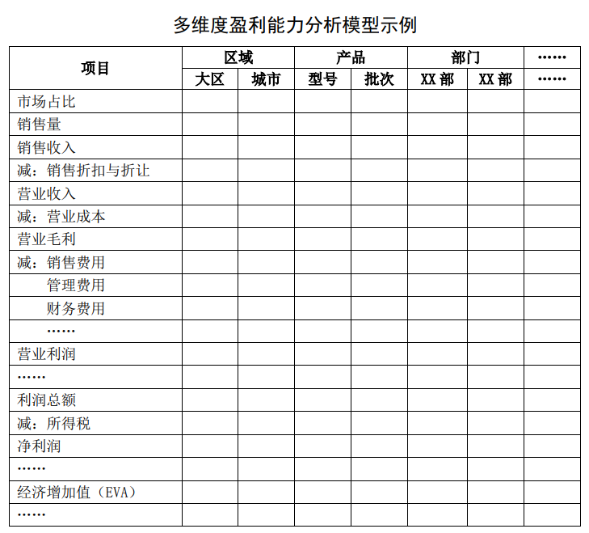

# 管理会计应用指引第 405 号——多维度盈利能力分析

 > 
<b>关于印发《管理会计应用指引第204号——作业预算》等5项 管理会计应用指引的通知</b>

 >
 > 财会〔2018〕38号
 >
 > 党中央有关部门，国务院各部委、各直属机构，全国人大常委会办公厅，全国政协办公厅，高法院，高检院，各省、自治区、直辖市、计划单列市财政厅（局），新疆生产建设兵团财政局，财政部驻各省、自治区、直辖市、计划单列市财政监察专员办事处：
 >
 > 　　为促进企业加强管理会计工作，提升内部管理水平，促进经济转型升级，根据《管理会计基本指引》，我部制定了《管理会计应用指引第204号——作业预算》等第三批5项管理会计应用指引，现予印发，请各单位在开展管理会计工作中参照执行。
 >
 > 　　附件：1.《管理会计应用指引第204号——作业预算》
 >
 > 　　2.《管理会计应用指引第404号——内部转移定价》
 >
 > 　　3.《管理会计应用指引第405号——多维度盈利能力分析》
 >
 > 　　4.《管理会计应用指引第702号——风险清单》
 >
 > 　　5.《管理会计应用指引第803号——行政事业单位》
 >
 > 
 >
 > 　　财 政 部
 >
 > 　　2018年12月27日
 >

--------------------------

 

 

 

<b>管理会计应用指引第 405 号——多维度盈利能力分析</b>

  

## 第一章 总 则

 第一条 多维度盈利能力分析，是指企业对一定期间内的经营成果，按照区域、产品、部门、客户、渠道、员工等维度进行计量，分析盈亏动因，从而支持企业精细化管理、满足内部营运管理需要的一种分析方法。

第二条 多维度盈利能力分析主要适用于市场竞争压力较大、组织结构相对复杂或具有多元化产品（或服务）体系的企业。企业应用多维度盈利能力分析工具方法，还应具备一定的信息化程度和管理水平。

  

## 第二章 应用环境

 第三条 企业应用多维度盈利能力分析工具方法，应遵循《管理会计应用指引第 400 号——营运管理》中对应用环境的一般要求。

第四条 企业应用多维度盈利能力分析工具方法，应按照多维度建立内部经营评价和成本管理制度，并按照管理最小颗粒度进行内部转移定价、成本分摊、业绩分成、经济增加值计量等。

管理最小颗粒度，是指企业根据实际管理需要与管理能力所确定的最小业务评价单元。

第五条 企业应用多维度盈利能力分析，通常需构建多维度盈利能力分析信息系统、模块或工具，制定统一的数据标准和规范，及时、准确、高效地获取各维度管理最小颗粒度相关信息。 

 

## 第三章 应用程序

 

第六条 企业进行多维度盈利能力分析，一般按照确定分析维度、建立分析模型、制定数据标准、收集数据、加工数据、编制分析报告等程序进行。

第七条 企业应根据组织架构、管理能力，以及绩效管理、销售管理、渠道管理、产品管理、生产管理、研发管理等管理需求，确定盈利能力分析各维度的类别，通常包括区域、产品、部门、客户、渠道、员工等。

第八条 企业应以营业收入、营业成本、利润总额、净利润、经济增加值（EVA）等核心财务指标为基础，构建多维度盈利能力分析模型（见附录 1）。

业财融合程度较高的企业可将与经营业绩直接相关的业务信息， 如销售量、市场份额、用户数等，纳入多维盈利能力分析模型。

金融企业在构建多维度盈利能力分析模型时，可加入经风险调整后的经济增加值（EVA）、风险调整资本回报率（RAROC）等指标。

第九条 企业应根据盈利能力分析各维度的分类规则和所构建的分析模型制定统一的基础数据标准和数据校验规则，保证各维度盈利能力分析数据基础的一致性和准确性，并通过系统参数配置、数据质量管控等在信息系统中予以实施。

 第十条 企业应根据管理最小颗粒度确定数据源的获取标准，并从信息系统中收集基础数据。有条件的企业可建立数据仓库或数据集市，形成统一规范的数据集。

第十一条 企业根据管理需求对收集的数据进行加工，一般包括以下几个方面：

（一）按照管理最小颗粒度进行内部转移定价、成本分摊、业绩分成及经济增加值计量等，并根据盈利能力分析模型，生成管理最小颗粒度盈利信息。

1. 企业应遵循[《管理会计应用指引第 404 号——内部转移定价》](404.md) 的一般要求，确定内部转移价格。

2. 企业应遵循“谁受益、谁负担”原则,通过建立科学有效的成本归集路径，将实际发生的完全成本基于业务动因相对合理地分摊到管理最小颗粒度。

3. 企业应依据业绩匹配原则，合理选择佣金法、量价法、比例法等方法，对业务协同产生的业绩进行分成。

4. 企业应遵循《管理会计应用指引第 602 号——经济增加值法》的一般要求，计量经济增加值。

（二）企业根据设定的数据标准，按管理最小颗粒度与区域、产品、部门、客户、渠道、员工等维度的归属关系进行分类汇总，生成各维度盈利信息。

第十二条 企业应根据管理需求，进一步整理、分析多维度盈利能力分析信息，综合使用趋势分析法、比率分析法、因素分析法等方法，从不同维度进行盈利能力分析，编制多维度盈利能力分析报告。

企业应根据报告使用者需求确定多维度盈利能力分析报告的具体内容，一般包括多维度盈利目标及其在报告期实现程度、整体盈亏的多维分析、各维度具体盈亏状况及其驱动因素分析（如区域下各产品、渠道盈利分析等）、各维度下经营发展趋势分析及风险预警、下一步的建议措施（如优化资源配置）等。

第十三条 企业编制多维度盈利能力分析报告时，可采用排序法、矩阵法、气泡图、雷达图等方法（[见附录 2](405.md#2)）对各维度盈利能力进行评估与分类。 

 

## 第四章 工具方法评价

 第十四条 多维度盈利能力分析的主要优点：可以灵活地支持企业实现精细化内部管理，为客户营销、产品管理、外部定价、成本管控、投资决策、绩效考核等提供相关、可靠的信息。

第十五条 多维度盈利能力分析的主要缺点：对企业管理能力、内部治理的规范性和数据质量等要求较高。

  

## 第五章 附 则

第十六条 本指引由财政部负责解释。

## 附录1：多维度盈利能力分析模型示例

 

注：本表可根据企业管理决策需要，增加或减少显示项目。

 

## 附录2：评估方法

1. **排序法**，是指将一定期间内各维度下的指标值进行排序，既可以按利润贡献度排序，也可以按综合指标总分排序，由高到低或按设定的标准分段。

2. **矩阵法**，是指将一定期间内各维度下的指标值纳入盈利矩阵的相应位置，以表示其盈利能力的类型。通常盈利矩阵以成本类指标为横坐标，以利润类指标为纵坐标，组合成四个象限。

3. **气泡图**，是指将一定期间内各维度下的指标值按其数值大小，以气泡大小列示于坐标图中，以直观表示其盈利能力。

4. **雷达图**，是指将一定期间内各维度下重要指标值纳入雷达形状的图中，同时展示各维度下盈利能力。