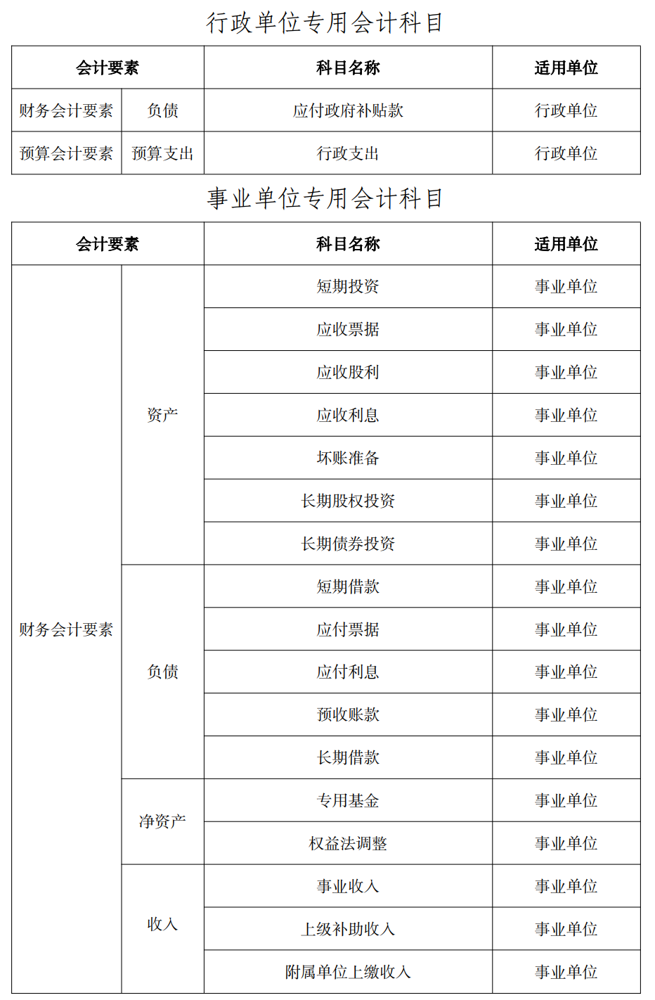
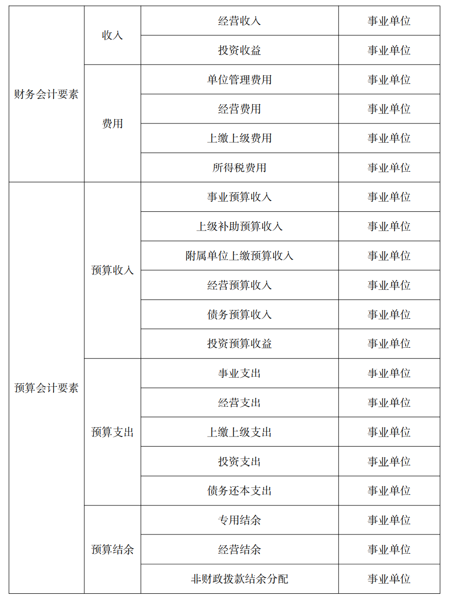

# 政府会计准则制度解释第4号

> **关于印发《政府会计准则制度解释第4号》的通知**
>
> **财会〔2021〕33号**
>
> 各中央预算单位，各省、自治区、直辖市、计划单列市财政厅（局），新疆生产建设兵团财政局：
>
> 为了进一步健全和完善政府会计准则制度，确保政府会计准则制度有效实施，根据《政府会计准则——基本准则》（财政部令第78号），我们制定了《政府会计准则制度解释第4号》，现予印发，请遵照执行。
>
> 附件：政府会计准则制度解释第4号
>
> 
>
> ​                                                                             财  政  部
>
> ​                                                                     2021年12月22日

------------------------------

## 一、关于参照公务员法管理的事业单位适用的会计科目

《政府会计制度——行政事业单位会计科目和报表》（以下简称《政府会计制度》）适用于各级各类行政单位和事业单位（以下统称单位）。通常情况下，参照公务员法管理的事业单位（以下简称参公单位）执行《行政单位财务规则》的，应当使用《政府会计制度》中适用于行政单位的会计科目；执行《事业单位财务规则》的，应当使用《政府会计制度》中适用于事业单位的会计科目。参公单位应当根据其开展的经济业务事项，并结合所执行的财务制度确定应当使用的会计科目。行政单位和事业单位专用会计科目见附录。

## 二、关于在建工程按照估计价值转固相关会计处理

根据《政府会计准则第3号——固定资产》（以下简称3号准则）、《政府会计准则第5号——公共基础设施》（以下简称5号准则）规定，已交付使用但尚未办理竣工财务决算手续的固定资产、公共基础设施，应当按照估计价值入账，待办理竣工财务决算后再按实际成本调整原来的暂估价值。

（一）估计价值的确定。

3号准则、5号准则中的估计价值，是指在办理竣工财务决算前，单位在建的建设项目工程的实际成本，包括项目建设资金安排的各项支出，以及应付未付的工程价款、职工薪酬等。估计价值应当根据“在建工程”科目相关明细科目的账面余额确定。

对于建设周期长、建设内容多的大型项目，单项工程已交付使用但尚未办理竣工财务决算手续的，单位应当先按照估计价值将单项工程转为固定资产、公共基础设施。对于一项在建工程涉及多项固定资产的，在建工程按照估计价值转固时，单位应当分别确定各项固定资产的估计价值。

在建工程按照估计价值转固之后、办理竣工财务决算之前，发生调整已确认的应付工程价款等影响估计价值的事项，单位应当先通过“在建工程”科目进行会计处理，再由在建工程转入固定资产、公共基础设施。

在建工程按照估计价值转固时，单位应当将该项目的工程竣工结算书、各项费用归集表或交付使用资产明细表等材料作为原始凭证。

单位应当在报表附注中披露按照估计价值入账的固定资产、公共基础设施的金额。

（二）按实际成本调整暂估价值的会计处理。

单位办理竣工财务决算后，按实际成本调整资产暂估价值时，应当将实际成本与暂估价值的差额计入净资产，借记或贷记“固定资产”、“公共基础设施”科目，贷记或借记“以前年度盈余调整”科目。经上述调整后，应将“以前年度盈余调整”科目的余额转入“累计盈余”科目。

根据3号准则、5号准则，单位应当对暂估入账的固定资产、公共基础设施计提折旧（根据政府会计准则制度规定无需计提折旧的除外），实际成本确定后不需调整原已计提的折旧额。单位按实际成本调整暂估价值后，应当以相关资产的账面价值（实际成本减去已提折旧后的金额）作为应计提折旧额，在规定的折旧年限扣除已计提折旧年限的剩余年限内计提折旧。

单位通过“在建工程”科目核算的信息系统项目工程、保障性住房项目工程，应当参照上述（一）、（二）中的规定进行会计处理。

## 三、关于固定资产、公共基础设施后续支出的会计处理

（一）后续支出资本化和费用化的划分。

根据3号准则、5号准则，固定资产、公共基础设施在使用过程中发生的后续支出，符合资产确认条件的，应当予以资本化计入固定资产、公共基础设施成本；不符合资产确认条件的，应当在发生时计入当期费用或者其他相关资产成本。

通常情况下，为增加使用效能或延长使用年限而发生的改建、扩建、大型维修改造等后续支出，应当计入相关资产成本；为维护正常使用而发生的日常维修、养护等后续支出，应当计入当期费用。列入部门预算支出经济分类科目中资本性支出的后续支出，应当予以资本化。

单位应当根据上述原则，结合有关行业主管部门对维修养护、改建扩建等的规定以及本单位实际，确定本单位固定资产、公共基础设施后续支出资本化和费用化划分的具体会计政策。

单位对于租入等不由本单位入账核算但实际使用的固定资产，发生的符合资产确认条件的后续支出，应当按照《政府会计制度》中“长期待摊费用”科目相关规定进行会计处理。

（二）改建、扩建后资产成本的确定。

根据3号准则、5号准则，在原有固定资产、公共基础设施基础上进行改建、扩建、大型维修改造等建造活动后的固定资产、公共基础设施，其成本按照原固定资产、公共基础设施账面价值加上改建、扩建、大型维修改造等建造活动发生的支出，再扣除固定资产、公共基础设施被替换部分的账面价值后的金额确定。

被替换部分的账面价值难以确定的，单位可以采用合理的分配方法计算确定，或组织专家参照资产评估方法进行估价。单位确定被替换部分的账面价值不切实可行或不符合成本效益原则的，可以不予扣除，但应当在报表附注中予以披露。

单位对于保障性住房发生的后续支出，应当参照上述（一）、（二）中的规定进行会计处理。

## 四、关于自行研究开发项目形成的无形资产成本的确定

根据《政府会计准则第4号——无形资产》（以下简称4号准则）规定，单位自行研究开发项目形成的无形资产，其成本包括自该项目进入开发阶段后至达到预定用途前所发生的支出总额。

（一）自行研究开发项目的识别。

4号准则中所指的自行研究开发项目，应当同时满足以下条件：

1.该项目以科技成果创造和运用为目的，预期形成至少一项科技成果。科技成果是指通过科学研究与技术开发所产生的具有实用价值的成果。

2.该项目的研发活动起点可以明确。例如，利用财政资金等单位外部资金设立的科研项目，可以将立项之日作为起点；利用单位自有资金设立的科研项目，可以将单位决策机构批准同意立项之日，或科研人员将研发计划书提交单位科研管理部门审核通过之日作为起点。

（二）自行研究开发项目支出的范围及会计处理。

4号准则中所指的自行研究开发项目的支出，包括从事研究开发及其辅助活动（以下简称研发活动）人员计提的薪酬，研发活动领用的库存物品，研发活动使用的固定资产和无形资产计提的折旧和摊销，为研发活动支付的其他各类费用等。其中，计提的薪酬根据《政府会计制度》，包括基本工资、国家统一规定的津贴补贴、规范津贴补贴（绩效工资）、改革性补贴、社会保险费、住房公积金等；为研发活动支付的其他各类费用包括业务费、劳务费、水电气暖费用等。

按照《政府会计制度》的规定，单位应当先通过“研发支出”科目归集自行研究开发项目的支出，借记“研发支出”科目，贷记“应付职工薪酬”、“库存物品”、“固定资产累计折旧”、“无形资产累计摊销”、“财政拨款收入”、“银行存款”、“零余额账户用款额度”、“预提费用”等科目。“研发支出”科目下归集的各项研发支出后续按4号准则相关规定转入当期费用或无形资产。

不属于4号准则所指的自行研究开发项目所发生的支出，应当在实际发生时计入当期费用。

（三）自行研究开发项目研究阶段和开发阶段的划分。

根据4号准则规定，单位自行研究开发项目的支出，应当区分研究阶段支出与开发阶段支出。对于研究阶段的支出，应当计入当期费用。对于开发阶段的支出，先按合理方法进行归集，最终形成无形资产的，应当确认为无形资产；最终未形成无形资产的，应当计入当期费用。

当单位自行研究开发项目预期形成的无形资产同时满足以下条件时，可以认定该自行研究开发项目进入开发阶段：

1.单位预期完成该无形资产以使其能够使用或出售在技术上具有可行性。

2.单位具有完成该无形资产并使用或出售的意图。

3.单位预期该无形资产能够为单位带来经济利益或服务潜能。该无形资产自身或运用该无形资产生产的产品存在市场，或者该无形资产在内部使用具有有用性。

4.单位具有足够的技术、财务资源和其他资源支持，以完成该无形资产的开发，并有能力使用或出售该无形资产。

5.归属于该无形资产开发阶段的支出能够可靠地计量。

通常情况下，单位可以将样品样机试制成功、可行性研究报告通过评审等作为自行研究开发项目进入开发阶段的标志，但该时点不满足上述进入开发阶段5个条件的除外。

## 五、关于财政国库集中支付结余不再按权责发生制列支的相关会计处理

根据《政府会计制度》规定，单位在年末需要做如下账务处理：财政直接支付方式下，根据本年度财政直接支付预算指标数大于当年财政直接支付实际支付数的差额，在财务会计借记“财政应返还额度——财政直接支付”科目，贷记“财政拨款收入”科目；在预算会计借记“资金结存——财政应返还额度”科目，贷记“财政拨款预算收入”科目。财政授权支付方式下，根据本年度财政授权支付预算指标数大于零余额账户用款额度下达数的差额，在财务会计借记“财政应返还额度——财政授权支付”科目，贷记“财政拨款收入”科目；在预算会计借记“资金结存——财政应返还额度”科目，贷记“财政拨款预算收入”科目。

按照《国务院关于进一步深化预算管理制度改革的意见》（国发〔2021〕5号）规定，市县级财政国库集中支付结余不再按权责发生制列支，相关单位年末不再进行上述账务处理。中央级和省级单位根据同级财政部门规范国库集中支付结余权责发生制列支的规定，相应进行会计处理。

## 六、关于单位取得代扣代收代征税款手续费的会计处理

单位从税务机关取得的代扣代缴、代收代缴、委托代征税款手续费按规定计入本单位收入，应当按照《政府会计制度》中“其他收入”科目相关规定进行财务会计处理，同时按照“其他预算收入”科目相关规定进行预算会计处理。

## 七、关于部门（单位）合并财务报表范围中所属事业单位的确认

《政府会计准则制度解释第2号》“九、关于部门（单位）合并财务报表范围”中的部门（单位）所属事业单位，其所属关系应当根据以下原则确认：

1.存在财政预算拨款关系的事业单位，以财政预算拨款关系为基础确认所属关系。

2.实行经费自理的事业单位，按照《事业单位法人证书》所列举办单位确认所属关系。涉及两个或两个以上举办单位的，按排序第一的举办单位确认，纳入该举办单位的合并财务报表编制范围；举办单位之间有协议、章程或管理办法约定的，按约定执行，不得重复编报。

## 八、关于部门（单位）合并财务报表的编制程序和抵销事项的处理

（一）相关基础工作要求。

1.单位应当加强本部门内部单位清单的管理和更新维护，可以在会计信息系统中将统一社会信用代码等作为部门内部单位的标识依据。发生内部业务或事项时，应当在明细核算或辅助核算中注明“本部门内部单位”。

2.单位对于经常发生的内部业务或事项，应当统一会计处理，并明确内部抵销规则。

3.单位应当根据内部业务或事项的发生频率及金额等因素，建立符合单位实际的定期对账机制，梳理并核对内部业务或事项，及时进行会计处理和调整。

（二）编制程序。

单位应当根据《政府会计准则第9号——财务报表编制和列报》（以下简称9号准则）第十七、十八条规定的程序，编制部门（单位）合并财务报表。一般流程如下：

1.将需要调整的个别财务报表调整为遵循政府会计准则制度规定的统一会计政策的财务报表，以调整后的个别财务报表作为编制合并财务报表的基础。被合并主体除了应当向合并主体提供财务报表外，还应当按照9号准则第二十一条的规定提供有关资料。

2.设置合并工作底稿。

3.将合并主体和被合并主体个别财务报表中的资产、负债、净资产、收入和费用项目金额逐项填入合并工作底稿，并加总得出个别资产负债表、个别收入费用表各项目合计金额。

4.在合并工作底稿上编制抵销分录，将合并主体和被合并主体之间、被合并主体相互之间发生的内部业务或事项对财务报表的影响进行抵销处理。

5.根据合并主体和被合并主体个别财务报表各项目合计金额、抵销分录发生额计算合并财务报表各项目的合并金额。抵销分录涉及收入、费用项目的，除调整合并收入费用表相应项目外，还应当结转调整合并资产负债表的净资产项目。

6.根据合并工作底稿中计算确定的各项目合并金额，填列合并财务报表。

（三）抵销内部业务或事项的会计处理。

单位应当根据9号准则第十八条第三款的规定，抵销合并主体和被合并主体之间、被合并主体相互之间发生的债权债务、收入费用等内部业务或事项对财务报表的影响，在合并工作底稿上编制相应抵销分录。

1.一般情况下的抵销处理。

（1）抵销部门内部单位之间的债权（含应收款项坏账准备）和债务项目。在编制抵销分录时，应当按照内部债权债务的金额，借记“应付票据”、“应付账款”、“预收账款”、“其他应付款”、“长期应付款”等项目，贷记“应收票据”、“应收账款净额”、“预付账款”、“其他应收款净额”等项目。

其中，债权方对应收款项已计提坏账准备的, 单位还应当分别以下情况编制抵销分录：

①初次编制合并报表的，按照内部应收款项计提的坏账准备的金额，借记“应收账款净额——坏账准备”、“其他应收款净额——坏账准备”项目，贷记“其他费用”项目。

②连续编制合并报表的。先按照上期抵销的内部应收款项计提的坏账准备的金额,借记“应收账款净额——坏账准备”、“其他应收款净额——坏账准备”项目,贷记“累计盈余——年初”项目。再按照本期个别资产负债表中期末内部应收款项相对应坏账准备的增加额,借记“应收账款净额——坏账准备”、“其他应收款净额——坏账准备”项目,贷记“其他费用”项目。本期个别资产负债表中期末内部应收款项所对应坏账准备金额减少的,做相反分录。

（2）抵销部门内部单位之间的上级补助收入和对附属单位补助费用项目。在编制抵销分录时，应当按照上级单位对附属单位补助的金额，借记“上级补助收入”项目，贷记“对附属单位补助费用”项目。

（3）抵销部门内部单位之间的上缴上级费用和附属单位上缴收入项目。在编制抵销分录时，应当按照附属单位向上级单位上缴的金额，借记“附属单位上缴收入”、“其他收入”（行政单位使用）项目，贷记“上缴上级费用”项目。

（4）抵销部门内部单位之间除（2）、（3）以外的收入和费用项目。在编制抵销分录时，应当按照内部交易的金额，借记“事业收入”、“非同级财政拨款收入”、“经营收入”、“租金收入”、“其他收入”等项目，贷记按费用性质列示的收入费用表中的“业务活动费用”、“单位管理费用”、“经营费用”、“其他费用”等项目；同时，贷记按费用经济分类列示的收入费用表中的“商品和服务费用”、“其他费用”等项目。

（5）对涉及增值税的应税业务，单位应当按照不含增值税的净额抵销收入和费用项目。

2.不抵销的内部业务或事项。

（1）付款方计入费用、收款方计入应缴财政款的，在编制部门（单位）合并财务报表时，该费用项目不应抵销。

（2）单位相互之间销售商品、提供劳务形成的存货、固定资产、工程物资、在建工程、无形资产等所包含的未实现内部销售损益，在国务院财政部门作出抵销处理的规定之前，单位在编制部门（单位）合并财务报表时暂不抵销。

（3）按照国务院财政部门财务报告编制的有关规定，金额不超过抵销阈值的，在编制部门（单位）合并财务报表时可以不进行抵销。

3.特殊情况下的抵销处理。

在各单位充分对账、会计处理正确的前提下，部门合并主体对于明细核算或辅助核算中注明“本部门内部单位”，但按照“1.一般情况下的抵销处理”规定未能进行抵销处理，且不属于“2.不抵销的内部业务或事项”的项目，可以直接按照内部业务或事项的金额编制抵销分录：借记有关应付及预收、收入项目，贷记有关应收及预付、费用项目，按其差额借记或贷记“累计盈余”项目。

部门合并主体应当在报表附注中披露按照特殊情况下的抵销处理方法抵销的项目及其金额。

（四）相关会计核算要求。

1.单位通过本部门内部单位转拨资金方式，从本部门以外单位取得收入（或向本部门以外单位支付费用）的，不属于编制部门（单位）合并财务报表时应当抵销的内部业务或事项。在会计核算时，转拨单位应当通过“其他应付款”科目进行会计处理。实际取得收入（或支付费用）的单位确认的收入（费用）、转拨单位确认的其他应付款，在会计核算时不应注明“本部门内部单位”，应当按资金的最初来源（最终支付对象）注明“本部门以外同级政府单位”、“本部门以外非同级政府单位”或“其他单位”。

2.编制部门（单位）合并财务报表过程中发现报告期和报告期以前期间的会计差错，属于报告日以后发生的调整事项，应当按照《政府会计准则第7号——会计调整》的规定进行会计处理，再根据调整后的个别财务报表编制合并财务报表。

## 九、关于生效日期

本解释“关于财政国库集中支付结余不再按权责发生制列支的相关会计处理”适用于2021及以后年度，“关于部门（单位）合并财务报表范围中所属事业单位的确认”适用于编制2021及以后年度的部门（单位）合并财务报表，“关于部门（单位）合并财务报表的编制程序和抵销事项的处理”适用于编制2022及以后年度的部门（单位）合并财务报表，其余规定自2022年1月1日起施行。本解释规定首次施行时均采用未来适用法。

## 附件

