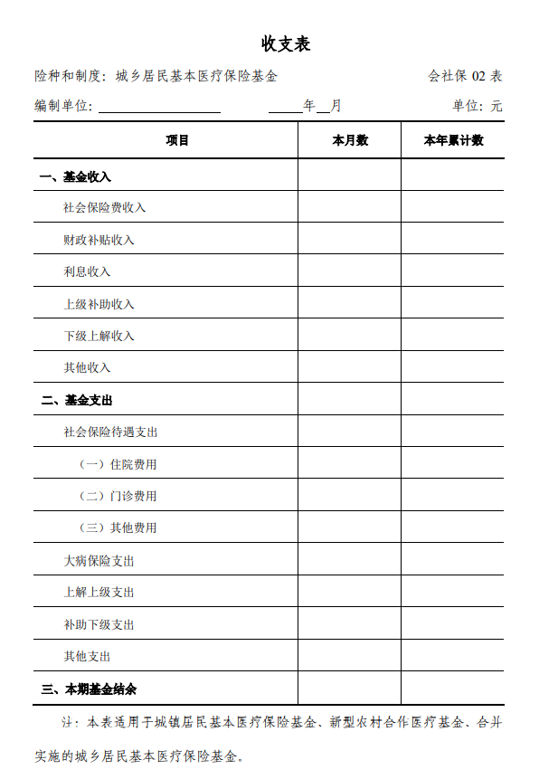
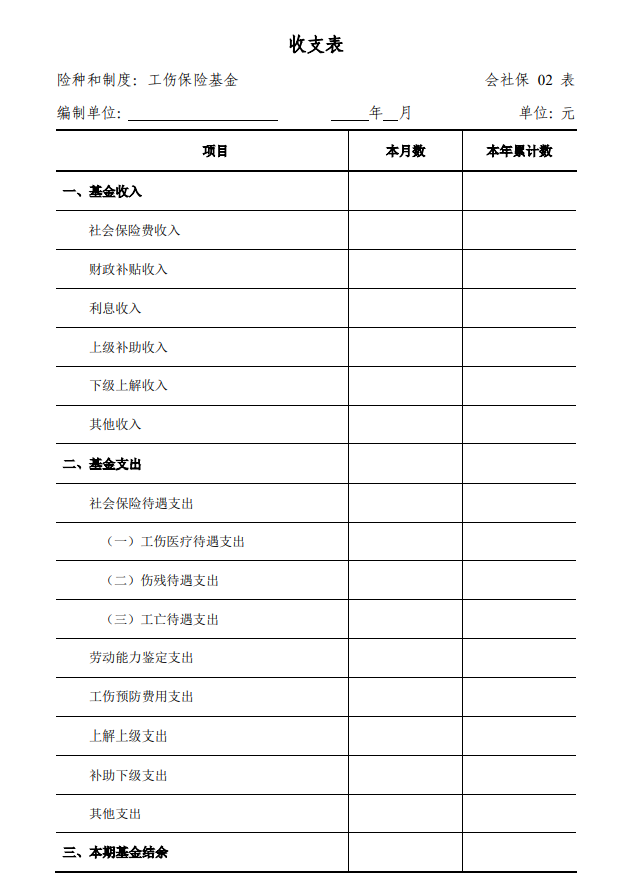
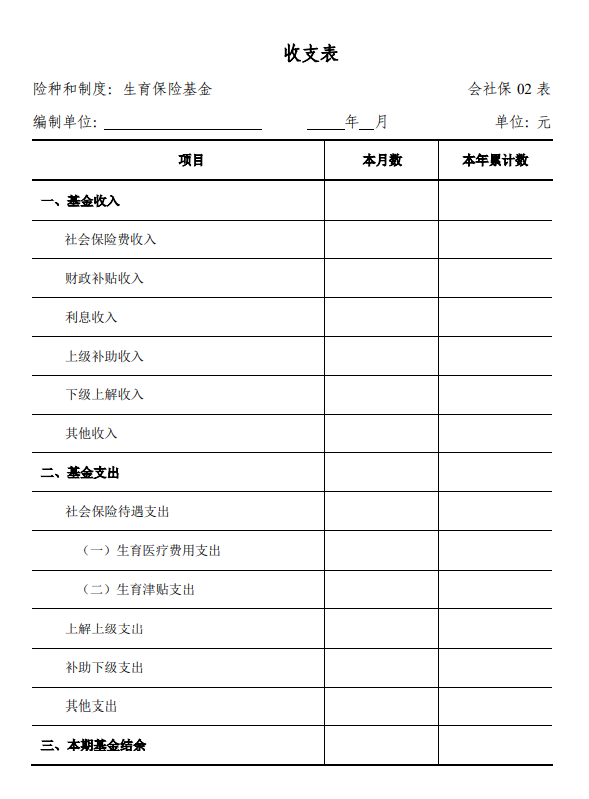

# 社会保险基金会计制度

> **关于印发《社会保险基金会计制度》的通知**
> **财会〔2017〕28号**
>
> 人力资源社会保障部、国家卫生计生委，各省、自治区、直辖市、计划单列市财政厅（局），新疆生产建设兵团财务局：
>
> 为适应社会保障体系建设需要，进一步规范社会保险基金的会计核算，提高会计信息质量，根据《中华人民共和国会计法》《中华人民共和国社会保险法》，结合新修订的《社会保险基金财务制度》（财社〔2017〕144号）规定，我部对《社会保险基金会计制度》（财会〔1999〕20号）进行了修订，现予印发，自2018年1月1日起施行。
>
> 执行中有何问题，请及时反馈我部。
>
> [附件：社会保险基金会计制度](0shebaojijin.assets/P020171214383017622166.pdf)
>
> ​                                                                            财 政 部
> ​                                                                  2017年11月28日

-----------------------------

 

## 社会保险基金会计制度

 

### 第一部分 总说明

 一、为了规范社会保险经办机构经办的社会保险基金的会计核算，根据《中华人民共和国会计法》《中华人民共和国社会保险法》，结合《社会保险基金财务制度》规定，制定本制度。

二、本制度适用于社会保险经办机构（以下简称经办机构） 负责经办的社会保险基金，包括在中华人民共和国境内依据《中 华人民共和国社会保险法》建立的企业职工基本养老保险基金、城乡居民基本养老保险基金、机关事业单位基本养老保险基金、职工基本医疗保险基金、城乡居民基本医疗保险基金（包括城镇 居民基本医疗保险基金、新型农村合作医疗基金、合并实施的城 乡居民基本医疗保险基金）、工伤保险基金、失业保险基金、生 育保险基金（生育保险与职工基本医疗保险合并实施的统筹地区， 不再单列生育保险基金）等基金。

经办机构经办的其他各类社会保险基金的会计核算，参照本制度执行。

本制度所称社会保险基金是指为了保障参保对象的权益和社会保险待遇，根据国家法律法规规定，由单位和个人缴纳、政府补助以及通过其他合法方式筹集的专项资金。

三、社会保险基金应当作为独立的会计主体进行核算。

四、经办机构应当将经办的各类社会保险基金按照险种及不同制度分别建账、分别核算。

五、社会保险基金的会计核算一般采用收付实现制，基本养老保险基金委托投资等部分业务或者事项的会计核算应当采用权责发生制。

六、社会保险基金的会计要素包括资产、负债、净资产、收入和支出。

七、社会保险基金的会计记账采用借贷记账法。

八、社会保险基金的会计核算应当划分会计期间，分期结算账目和编制财务报表。会计期间的起讫日期采用公历制。

九、社会保险基金的会计核算应当遵循以下基本原则：

（一）社会保险基金的会计核算应当以实际发生的业务为依据，如实反映社会保险基金的财务状况和收支情况等信息，保证会计信息真实可靠、内容完整。

（二）社会保险基金的会计核算应当采用规定的会计政策， 确保会计信息口径一致、相互可比。

（三）社会保险基金的会计核算应当及时进行，不得提前或者延后。

十、经办机构应当按照下列规定运用会计科目对社会保险基金进行会计核算：

（一）经办机构应当区分险种及不同制度，按照本制度的规定设置和使用会计科目、填制会计凭证、登记会计账簿。

（二）经办机构应当执行本制度统一规定的会计科目编号， 以便于填制会计凭证、登记账簿、查阅账目。

（三）在填制会计凭证、登记账簿时，经办机构应当填列会计科目的名称，或者同时填列会计科目的名称和编号，不得只填列科目编号而不填列科目名称。

（四）在不违反本制度的前提下，经办机构可以根据核算和管理工作需要对明细科目的设置作必要的补充。

十一、经办机构应当按照下列规定编制社会保险基金财务报表：

（一）经办机构应当按照本制度的规定，区分基金险种及不同制度分别编制社会保险基金财务报表。

（二）社会保险基金财务报表包括资产负债表、收支表及附注。

（三）社会保险基金财务报表应当按照月度和年度编制。

（四）社会保险基金财务报表应当根据登记完整、核对无误的账簿记录和其他有关资料编制，做到数字真实、计算准确、内容完整、编报及时。

十二、社会保险基金相关会计基础工作、会计档案管理以及内部控制等，应当遵循《中华人民共和国会计法》《会计基础工作规范》《会计档案管理办法》及国家有关内部控制规范等相关法律、规章和制度规定。

社会保险基金相关会计信息化工作，应当符合财政部制定的相关会计信息化工作规范和标准，确保利用现代信息技术手段开展会计核算及生成的会计信息符合本制度的规定。

十三、本制度自 2018 年 1 月 1 日起施行。《财政部关于印发<社会保险基金会计制度>的通知》（财会〔1999〕20 号）、《财政部关于印发<社会保险基金会计核算若干问题补充规定>的通知》（财会〔2003〕19 号）、《财政部关于印发<新型农村合作医疗基金会计制度>的通知》（财会〔2008〕1 号）、《财政部关于印发< 新型农村社会养老保险基金会计核算暂行办法>的通知》（财会〔2011〕3 号）、《财政部关于印发<利用基本医疗保险基金向商业保险机构购买城乡居民大病保险会计核算补充规定>的通知》（财会〔2013〕21 号）、《财政部关于做实企业职工基本养老保险个人账户中央补助资金投资会计核算有关问题的通知》（财会〔2014〕19 号）同时废止。

### 第二部分 会计科目名称和编号

  

| 序号         | 科目编号 | 科目名称           | 备注                                                         |
| ------------ | -------- | ------------------ | ------------------------------------------------------------ |
| 一、资产类   |          |                    |                                                              |
| 1            | 1001     | 库存现金           |                                                              |
| 2            | 1002     | 收入户存款         |                                                              |
| 3            | 1003     | 财政专户存款       |                                                              |
| 4            | 1004     | 支出户存款         |                                                              |
| 5            | 1005     | 国库存款           |                                                              |
| 6            | 1101     | 暂付款             |                                                              |
| 7            | 1201     | 债券投资           |                                                              |
| 8            | 1202     | 委托投资           | 企业职工、城乡居民、机关事业单位基本养老保险基金（省级）专用科目 |
| 二、负债类   |          |                    |                                                              |
| 9            | 2001     | 暂收款             |                                                              |
| 10           | 2101     | 借入款项           |                                                              |
| 三、净资产类 |          |                    |                                                              |
| 11           | 3001     | 一般基金结余       |                                                              |
| 12           | 3101     | 风险基金结余       | 提取风险基金的新型农村合作医疗基金专用科目                   |
| 13           | 3201     | 储备金结余         | 工伤保险基金专用科目                                         |
| 四、收入类   |          |                    |                                                              |
| 14           | 4001     | 社会保险费收入     |                                                              |
| 15           | 4101     | 财政补贴收入       |                                                              |
| 16           | 4102     | 集体补助收入       | 城乡居民基本养老保险基金专用科目                             |
| 17           | 4201     | 利息收入           |                                                              |
| 18           | 4202     | 委托投资收益       | 企业职工、城乡居民、机关事业单位基本养老保险基金专用科目     |
| 19           | 4301     | 转移收入           |                                                              |
| 20           | 4401     | 上级补助收入       |                                                              |
| 21           | 4402     | 下级上解收入       |                                                              |
| 22           | 4501     | 其他收入           |                                                              |
| 23           | 4601     | 待转社会保险费收入 | 职工基本医疗保险基金专用科目                                 |
| 24           | 4602     | 待转利息收入       | 职工基本医疗保险基金专用科目                                 |
| 五、支出类   |          |                    |                                                              |
| 25           | 5001     | 社会保险待遇支出   |                                                              |
| 26           | 5101     | 大病保险支出       | 职工、城乡居民基本医疗保险基金专用科目                       |
| 27           | 5102     | 劳动能力鉴定支出   | 工伤保险基金专用科目                                         |
| 28           | 5103     | 工伤预防费用支出   | 工伤保险基金专用科目                                         |
| 29           | 5104     | 稳定岗位补贴支出   | 失业保险基金专用科目                                         |
| 30           | 5105     | 技能提升补贴支出   | 失业保险基金专用科目                                         |
| 31           | 5201     | 转移支出           |                                                              |
| 32           | 5301     | 上解上级支出       |                                                              |
| 33           | 5302     | 补助下级支出       |                                                              |
| 34           | 5401     | 其他支出           |                                                              |

### 第三部分 会计科目使用说明

#### 一、资产类

##### 1001 库存现金

一、本科目核算社会保险基金的库存现金。

二、经办机构应当严格按照国家有关现金管理的规定以及社会保险基金相关管理和财务制度规定收支现金。

三、库存现金的主要账务处理如下：

（一）提取现金，按照实际提取的金额，借记本科目，贷记“支出户存款”等科目。

（二）支出现金，按照实际支出的金额，借记“社会保险待遇支出”等科目，贷记本科目。

四、本科目应当设置“库存现金日记账”，由出纳人员根据收付款凭证，逐笔顺序登记。每日终了，应当计算当日的现金收入合计数、现金支出合计数和结余数，并将结余数与实际库存数进行核对，做到账款相符。

五、本科目期末借方余额，反映社会保险基金的库存现金余额。

##### 1002 收入户存款

一、本科目核算社会保险基金按规定存入收入户的款项。

二、经办机构应当严格按照社会保险基金相关管理和财务制度规定设置基金收入户并办理收入户相关业务。

三、收入户存款的主要账务处理如下：

（一）按规定接收经办机构征收的社会保险费收入、接收上级经办机构下拨或下级经办机构上解的基金收入、接收收入户利息收入、接收社会保险基金转移收入以及其他收入等时，按照实际收到的金额，借记本科目，贷记相关科目。

（二）按规定从收入户向财政专户划转基金、向上级基金缴拨基金等时，按照实际划转或缴拨金额，借记相关科目，贷记本科目；原渠道退回社会保险费收入、转移收入时，按照实际退回金额，借记相关科目，贷记本科目。

四、本科目应当按照开户银行设置“收入户存款日记账”，由出纳人员根据收付款凭证，逐笔顺序登记。每日终了，应当结出余额。

“收入户存款日记账”应当定期与“银行对账单”核对，至少每月核对一次。月度终了，收入户存款账面余额与银行对账单余额之间如有差额，应当逐笔查明原因进行处理，并按月编制“银行收入户存款余额调节表”，调节相符。

五、收入户存款应当按规定定期划转财政专户。划转后，本科目期末一般应无余额。

##### 1003 财政专户存款

一、本科目核算社会保险基金按规定存入财政专户的款项。

二、经办机构应当严格按照社会保险基金相关管理和财务制度规定办理财政专户相关业务。

三、本科目可以根据实际情况按照开户银行、活期定期存款、存储期限等进行明细核算。

四、财政专户存款的主要账务处理如下：

（一）按规定财政专户接收税务机关或经办机构缴入的社会 保险费收入、接收税务机关、收入户及支出户缴入的利息收入、接收委托投资运营资金、接收委托投资收益、接收财政补贴收入、接收转移收入、接收上级财政专户划拨或下级财政专户上解基金、接收跨省异地就医资金等时，按照实际收到金额，借记本科目， 贷记相关科目。

（二）按规定从财政专户向上级或下级财政专户上缴或划拨基金、根据经办机构用款计划和预算向支出户拨付基金、拨付委托投资运营资金、支付跨省异地就医资金等时，按照实际上缴、划拨或支付金额，借记相关科目，贷记本科目。

五、本科目应当按照开户银行设置“财政专户存款日记账”， 由出纳人员根据收付款凭证，逐笔顺序登记。每日终了，应当结出余额。

“财政专户存款日记账”应当定期与财政部门核对，至少每月核对一次。月度终了，财政专户存款账面余额与财政部门提供的对账凭证余额之间如有差额，应当逐笔查明原因进行处理，并按月编制“财政专户存款余额调节表”，调节相符。

六、本科目期末借方余额，反映社会保险基金财政专户存款余额。

##### 1004 支出户存款

一、本科目核算社会保险基金按规定存入支出户的款项。

二、经办机构应当严格按照社会保险基金相关管理和财务制度规定设置基金支出户并办理支出户相关业务。

三、支出户存款的主要账务处理如下：

（一）按规定支出户接收财政专户拨入基金、接收上级经办机构拨付基金、接收支出户利息收入等时，按照实际收到的金额， 借记本科目，贷记相关科目。接收原渠道退回支付资金时，按照实际收到的金额，借记本科目，贷记相关科目。

（二）按规定从支出户支付基金支出款项、向财政专户缴入该账户利息收入、上解上级经办机构基金或下拨下级经办机构基金等时，按照实际支付金额，借记相关科目，贷记本科目。

四、本科目应当按照开户银行设置“支出户存款日记账”，由出纳人员根据收付款凭证，逐笔顺序登记。每日终了，应当结出余额。

“支出户存款日记账”应当定期与“银行对账单”核对，至少每月核对一次。月度终了，支出户存款账面余额与银行对账单余额之间如有差额，应当逐笔查明原因进行处理，并按月编制“银行支出户存款余额调节表”，调节相符。

五、本科目期末借方余额，反映社会保险基金支出户存款余额。

##### 1005 国库存款

一、本科目核算税务机关征收的存入国库、尚未转入财政专户的社会保险费款项。

二、国库存款的主要账务处理如下：

（一）税务机关将征收的社会保险费存入国库，经办机构根据取得的相关凭证，借记本科目，贷记“社会保险费收入”科目。

（二）按规定将国库存款转入财政专户，经办机构根据实际转入的金额，借记“财政专户存款”科目，贷记本科目。

（三）收到国库存款利息，按照实际收到的金额，借记本科目，贷记“利息收入”科目。

三、国库存款应当按规定定期划转财政专户。划转后，本科目期末一般应无余额。

##### 1101 暂付款

一、本科目核算社会保险基金业务活动中形成的各类暂付、应收款项，包括各类预付、预拨、先行支付、垫付款项等。

企业职工、城乡居民、机关事业单位基本养老保险基金向上级基金归集的委托投资资金，以及职工、城乡居民基本医疗保险基金跨省异地就医的预付资金，通过本科目核算。

新型农村合作医疗基金在风险基金实行省级统一管理的统筹地区，缴存省级财政专户的风险基金，通过本科目核算。

基本医疗保险基金、工伤保险基金按规定先行支付的医疗、工伤保险待遇支出通过本科目核算。

二、本科目应当按照暂付款种类和对方单位或个人进行明细核算。

对于企业职工、城乡居民、机关事业单位基本养老保险基金向上级基金归集的委托投资资金，应当在本科目下设置“委托上级投资”明细科目，并在该明细科目下设置“本金”“利息”“投资收益”明细科目，分别核算向上级基金归集的委托投资资金的本金、委托投资资金所产生的存款利息、投资收益。

对于职工、城乡居民基本医疗保险基金跨省异地就医的预付资金，应当在本科目下设置“异地就医预付金”明细科目，并在该明细科目下按照预付对方地区进行明细核算，核算参保地区向就医地区划拨的跨省异地就医预付资金。

新型农村合作医疗基金在风险基金实行省级统一管理的统筹地区，应当在本科目下设置“缴存风险基金”明细科目。

三、暂付款的主要账务处理如下：

（一）企业职工、城乡居民、机关事业单位基本养老保险基金将委托投资资金归集到上级基金，按照实际划出的金额，借记本科目（委托上级投资——本金），贷记“财政专户存款”科目。非省级基金收到归集到上级基金的委托投资资金的存款利

息通知，按照应确认的总金额，借记本科目（委托上级投资—— 利息），按照本级委托投资资金产生的利息金额，贷记“利息收入” 科目，按照下级归集的委托投资资金产生的利息金额，贷记“暂收款——下级归集委托投资（利息）”科目。

非省级基金收到归集到上级基金的委托投资资金的投资收 益通知，按照应确认的投资收益或投资损失金额，借记或贷记本科目（委托上级投资——投资收益），按照本级委托投资资金形 成的投资收益或投资损失金额，贷记或借记“委托投资收益”科目， 按照下级归集的委托投资资金形成的投资收益或投资损失金额， 贷记或借记“暂收款——下级归集委托投资（投资收益）”科目。

收到上级基金划回的委托投资资金本金、利息和投资收益， 按照实际收到的金额，借记“财政专户存款”科目，按照应收回的委托投资资金本金金额，贷记本科目（委托上级投资——本金），按照应收回的委托投资资金存款利息金额，贷记本科目（委托上级投资——利息），按照实际收回的金额与应收回的委托投资资金本金和利息之间的差额，贷记或借记本科目（委托上级投资——投资收益）。

（二）职工、城乡居民基本医疗保险基金参保省非省级经办机构向上级经办机构上解本级跨省异地就医预付金，按照实际上解的金额，借记本科目（异地就医预付金），贷记“财政专户存款” 等科目。

参保省省级经办机构向就医省省级经办机构拨付省本级的异地就医预付金，按照实际拨付的金额，借记本科目（异地就医预付金），贷记“财政专户存款”等科目。

参保省各级经办机构收到退回的归属本级基金的跨省异地就医预付金，按照实际收到的金额，借记“财政专户存款”等科目，贷记本科目（异地就医预付金）。

（三）新型农村合作医疗基金在风险基金实行省级统一管理的统筹地区，按规定将风险基金缴存省级财政专户，按照实际缴存的金额，借记本科目（缴存风险基金），贷记“财政专户存款” 科目。

风险基金由省级财政专户拨回，按照实际收到的金额，借记“财政专户存款”科目，贷记本科目（缴存风险基金）。

（四）支付其他各类预付、预拨、先行支付、垫付等款项， 按照实际支付的金额，借记本科目，贷记“支出户存款”“财政专户存款”科目。

收回、结算各类预付、预拨、先行支付、垫付等款项，按照实际收回或结算的金额，借记“收入户存款”“财政专户存款”、“支出户存款”“社会保险待遇支出”等科目，贷记本科目。

（五）因债务人等特殊原因确实无法收回的暂付款，按照报经批准后列作其他支出的金额，借记“其他支出”科目，贷记本科目。

四、本科目期末借方余额，反映社会保险基金尚未结清的暂付款项。

##### 1201 债券投资

一、本科目核算社会保险基金按规定购入国债的成本。

二、本科目应当按照国债的种类设置明细账，进行明细核算。

三、债券投资的主要账务处理如下：

（一）按规定购买国债，按照实际支付的金额（包括购买价款以及税金、手续费等相关税费），借记本科目，贷记“财政专户存款”科目。

（二）到期收回国债本息或按规定转让国债，按照实际收回或收到的金额，借记“财政专户存款”科目，按照债券账面余额， 贷记本科目，按照其差额，贷记“利息收入”科目。

四、本科目期末借方余额，反映社会保险基金持有的国债购入成本。

##### 1202 委托投资

一、本科目核算企业职工、城乡居民、机关事业单位基本养老保险基金的省级基金按规定及委托投资合同约定划拨给受托机构的委托投资资金本金，以及委托投资资金形成的投资收益或投资损失。

二、本科目应当设置“本金”“投资收益”两个明细科目，并按照受托机构、委托投资资金来源等进行明细核算。

三、委托投资的主要账务处理如下：

（一）省级基金从财政专户向受托机构划拨委托投资资金， 按照实际划转的金额，借记本科目（本金），贷记“财政专户存款” 科目。

（二）省级基金收到受托机构提供的关于委托投资资金投资收益的相关通知，按照应确认的投资收益或投资损失金额，借记或贷记本科目（投资收益），按照本级委托投资资金形成的投资收益或投资损失金额，贷记或借记“委托投资收益”科目，按照下级归集的委托投资资金形成的投资收益或投资损失金额，贷记或借记“暂收款——下级归集委托投资（投资收益）”科目。

（三）省级基金收回委托投资资金的本金和投资收益，按照实际转入的金额，借记“财政专户存款”科目，按照应收回的委托投资本金金额，贷记本科目（本金），按照实际收回的金额与应收回的委托投资资金本金之间的差额，贷记或借记本科目（投资收益）。

（四）省级基金将已确认的委托投资收益转作委托投资本金， 按照实际划转的金额，借记本科目（本金），贷记本科目（投资 收益）。

四、本科目期末借方余额，反映企业职工、城乡居民、机关事业单位基本养老保险基金省级委托投资资金的本金及投资损益余额。

 

#### 二、负债类

##### 2001 暂收款

一、本科目核算社会保险基金业务活动中形成的各类暂收款项。

企业职工、城乡居民、机关事业单位基本养老保险基金收到下级归集的委托投资资金，以及职工、城乡居民基本医疗保险基金跨省异地就医的预收和清算资金，通过本科目核算。

新型农村合作医疗基金在风险基金实行省级统一管理的统筹地区，省级财政专户收到的风险基金，通过本科目核算。

二、本科目应当按照暂收款的种类和对方单位或个人进行明细核算。

对于企业职工、城乡居民、机关事业单位基本养老保险基金收到下级归集的委托投资资金，应当在本科目下设置“下级归集委托投资”明细科目，并在该明细科目下设置“本金”“利息”“投资收益”明细科目，分别核算下级归集的委托投资资金本金、委托投资资金产生的存款利息、投资收益。

对于职工、城乡居民基本医疗保险基金跨省异地就医的预付和清算资金，应当在本科目下设置“异地就医预付金”“异地就医清算资金”和“异地就医资金”明细科目，其中，“异地就医预付金”“异地就医清算资金”明细科目分别用于核算参保地区上级经办机构收到下级经办机构归集的异地就医预付金、清算资金，“异地就医资金”明细科目用于核算就医地区接收参保地区划拨的异地就医预付金和清算资金。

新型农村合作医疗基金在风险基金实行省级统一管理的统筹地区，应当在本科目下设置“缴存风险基金”明细科目。

三、暂收款的主要账务处理如下：

（一）企业职工、城乡居民、机关事业单位基本养老保险基金收到下级归集的委托投资资金，按照实际收到的金额，借记“财政专户存款”科目，贷记本科目（下级归集委托投资——本金）。

省级基金收到下级基金归集的委托投资资金所产生的存款利息，根据实际收到的金额，借记“财政专户存款”科目，贷记本科目（下级归集委托投资——利息）。

省级基金收到受托机构提供的关于委托投资资金投资收益的相关通知，按照应确认的投资收益或投资损失金额，借记或贷记“委托投资——投资收益”科目，按照本级委托投资资金形成的投资收益或投资损失金额，贷记或借记“委托投资收益”科目，按照下级归集的委托投资资金形成的投资收益或投资损失金额，贷记或借记本科目（下级归集委托投资——投资收益）。

非省级基金收到归集到上级基金的委托投资资金的存款利息通知，按照应确认的总金额，借记“暂付款——委托上级投资（利息）”科目，按照本级委托投资资金产生的利息金额，贷记“利息收入”科目，按照下级归集的委托投资资金产生的利息金额， 贷记本科目（下级归集委托投资——利息）。

非省级基金收到归集到上级基金的委托投资资金的投资收 益通知，按照应确认的投资收益或投资损失金额，借记或贷记“暂 付款——委托上级投资（投资收益）”科目，按照本级委托投资 资金形成的投资收益或投资损失金额，贷记或借记“委托投资收 益”科目，按照下级归集的委托投资资金形成的投资收益或投资 损失金额，贷记或借记本科目（下级归集委托投资——投资收益）。

向下级基金返还归集的委托投资资金本金、利息和投资收益， 按照应返还委托投资资金本金的金额，借记本科目（下级归集委托投资——本金），按照应返还委托投资资金的存款利息金额，借记本科目（下级归集委托投资——利息），按照实际返还金额与应返还的委托投资资金本金和利息之间的差额，借记或贷记本科目（下级归集委托投资——投资收益），按照实际返还的金额， 贷记“财政专户存款”科目。

（二）职工、城乡居民基本医疗保险基金参保省非省级经办机构收到下级经办机构归集的跨省异地就医预付金，按照实际收到的金额，借记“财政专户存款”等科目，贷记本科目（异地就医预付金）。非省级经办机构向上级经办机构上解收到的下级经办机构归集的预付金，按照实际上解的金额，借记本科目（异地就医预付金），贷记“财政专户存款”等科目。

参保省省级经办机构收到下级经办机构归集的跨省异地就医预付金，按照实际收到的金额，借记“财政专户存款”等科目， 贷记本科目（异地就医预付金）。省级经办机构向就医省省级经办机构拨付收到的下级经办机构归集的跨省异地就医预付金，按照实际拨付的金额，借记本科目（异地就医预付金），贷记“财政专户存款”等科目。

参保省省级经办机构收到就医省省级经办机构退回的跨省 异地就医预付金，按照属于下级基金的跨省异地就医预付金金额， 借记“财政专户存款”等科目，贷记本科目（异地就医预付金）。 参保省省级经办机构向下级经办机构拨付退回的属于下级基金 的跨省异地就医预付金，按照实际拨付的金额，借记本科目（异地就医预付金），贷记“财政专户存款”等科目。

参保省非省级经办机构收到上级经办机构退回的跨省异地就医预付金，按照属于下级基金的跨省异地就医预付金金额，借记“财政专户存款”等科目，贷记本科目（异地就医预付金）。非省级经办机构向下级经办机构拨付退回的属于下级基金的跨省异地就医预付金，按照实际拨付的金额，借记本科目（异地就医预付金），贷记“财政专户存款”等科目。

参保省非省级经办机构收到下级经办机构归集的跨省异地就医清算资金，按照实际收到的金额，借记“财政专户存款”等科目，贷记本科目（异地就医清算资金）。非省级经办机构向上级经办机构上解收到的下级经办机构归集的跨省异地就医清算资金，按照实际上解的金额，借记本科目（异地就医清算资金），贷记“财政专户存款”等科目。

参保省省级经办机构收到下级经办机构归集的跨省异地就医清算资金，按照实际收到的金额，借记“财政专户存款”等科目， 贷记本科目（异地就医清算资金）。参保省省级经办机构向就医省省级经办机构拨付收到的下级经办机构归集的跨省异地就医清算资金，按照实际拨付的金额，借记本科目（异地就医清算资金），贷记“财政专户存款”等科目。

（三）职工、城乡居民基本医疗保险基金就医省省级经办机构收到参保省省级经办机构划拨的跨省异地就医预付金和清算资金，按照实际收到的金额，借记“财政专户存款”等科目，贷记本科目（异地就医资金）。就医省省级经办机构向参保省省级经办机构退回的跨省异地就医预付金，按照实际退回的金额，借记本科目（异地就医资金），贷记“财政专户存款”等科目。

就医省上级经办机构向下级经办机构划拨预付金，用于向定点医疗机构结算跨省异地就医人员医疗费用时，按照实际划拨的金额，借记本科目（异地就医资金），贷记“财政专户存款”等科目。

就医省下级经办机构收到上级经办机构划拨的预付金，按照实际收到的金额，借记“财政专户存款”等科目，贷记本科目（异地就医资金）。

就医省经办机构向定点医疗机构结算跨省异地就医人员发生的医疗费用，按照实际结算的金额，借记本科目（异地就医资金），贷记“财政专户存款”等科目。

（四）新型农村合作医疗基金省级基金收到下级基金按规定缴入省级财政专户的风险基金，按照实际缴存的金额，借记“财政专户存款”科目，贷记本科目（缴存风险基金）。

（五）取得其他暂收款项，按照实际收到的金额，借记“财政专户存款”等科目，贷记本科目。

偿付或结清暂收款项，按照实际偿付或结清的金额，借记本科目，贷记“支出户存款”“财政专户存款”等科目。

（六）因债权人等特殊原因确实无法偿付的暂收款项，按照报经批准后确认为其他收入的金额，借记本科目，贷记“其他收入”科目。

四、本科目期末贷方余额，反映社会保险基金尚未偿付或结清的暂收款项。

##### 2101 借入款项

一、本科目核算社会保险基金运行过程中形成的借入款项。

二、本科目应当按照借入款项对方单位或个人进行明细核算。

三、借入款项的主要账务处理如下：

（一）借入款项时，按照实际收到的金额，借记“财政专户存款”科目，贷记本科目。

（二）归还借款本息时，按照实际支付的本金金额，借记本科目，按照实际支付的利息金额，借记“其他支出”科目，按照实际支付的本息合计金额，贷记“财政专户存款”科目。

（三）借入款项由财政代为偿还时，按照实际偿还金额，借记本科目，贷记“财政补贴收入”科目。

（四）因债权人等特殊原因确实无法偿付的，按照报经批准后确认为其他收入的金额，借记本科目，贷记“其他收入”科目。

四、本科目期末贷方余额，反映社会保险基金尚未偿付的借入款项。

 

#### 三、净资产类

##### 3001 一般基金结余

一、本科目核算社会保险基金历年累积的基金收支相抵后的除风险基金、储备金等特定用途基金外的基金结余。

二、对于职工基本医疗保险基金，应当在本科目下设置“统筹基金”“个人账户基金”明细科目。

三、一般基金结余的主要账务处理如下：

（一）期末，将各收入类科目本期发生额转入本科目，借记各收入类科目，贷记本科目。

“委托投资收益”科目结转前如为借方余额，则借记本科目， 贷记“委托投资收益”科目。

对于职工基本医疗保险基金，应当将“财政补贴收入”科目本期发生额以及“社会保险费收入”“利息收入”“上级补助收入”“下级上解收入”“其他收入”科目所属“统筹基金”明细科目的本期发生额转入本科目（统筹基金），借记“财政补贴收入”“社会保险费收入——统筹基金”“利息收入——统筹基金”“上级补助收入——统筹基金”“下级上解收入——统筹基金”“其他收入——统筹基金”科目，贷记本科目（统筹基金）；将“转移收入”科目本期发生额以及“社会保险费收入”“利息收入”“上级补助收入”“下级上解收入”“其他收入”科目所属“个人账户基金”明细科目的本期发生额转入本科目（个人账户基金），借记“转移收入”“社会保险费收入——个人账户基金”“利息收入——个人账户基金”“上级补助收入——个人账户基金”“下级上解收入——个人账户基金”“其他收入——个人账户基金”科目，贷记本科目（个人账户基金）。

（二）期末，将各支出类科目本期发生额转入本科目，借记本科目，贷记各支出类科目。

对于职工基本医疗保险基金，应当将“ 社会保险待遇支出”“上解上级支出”“补助下级支出”、“其他支出”科目所属“统筹基金”明细科目的本期发生额转入本科目（统筹基金），借记本科目（统筹基金），贷记“社会保险待遇支出——统筹基金”“上解上级支出——统筹基金”“补助下级支出——统筹基金”“其他支出——统筹基金”科目；将“转移支出”科目本期发生额以及“社会保险待遇支出”“上解上级支出”“补助下级支出”“其他支出”科目所属“个人账户基金”明细科目的本期发生额转入本科目（个人账户基金），借记本科目（个人账户基金），贷记“转移支出”“社会保险待遇支出——个人账户基金”“上解上级支出——个人账户基金”“补助下级支出——个人账户基金”“其他支出——个人账户基金”科目。

（三）新型农村合作医疗基金统筹地区提取风险基金，按照提取的金额，借记本科目，贷记“风险基金结余”科目。

风险基金转入一般基金结余时，按照实际划转金额，借记“风险基金结余”科目，贷记本科目。

（四）工伤保险基金提取储备金，按照提取的金额，借记本科目，贷记“储备金结余”科目。

储备金转入一般基金结余时，按照实际划转金额，借记“储备金结余”科目，贷记本科目。

四、本科目期末贷方余额，反映期末除风险基金、储备金等特定用途基金外的基金结余。

##### 3101 风险基金结余

一、本科目核算新型农村合作医疗基金按规定提取的风险基金。

二、风险基金结余的主要账务处理如下：

（一）提取风险基金，按照提取的金额，借记“一般基金结余”科目，贷记本科目。

（二）风险基金转入一般基金结余时，按照实际划转金额， 借记本科目，贷记“一般基金结余”科目。

三、本科目期末贷方余额，反映新型农村合作医疗基金提取的风险基金累计结余。

##### 3201 储备金结余

一、本科目核算工伤保险基金按规定提取的储备金。

二、储备金结余的主要账务处理如下：

（一）提取储备金，按照提取的金额，借记“一般基金结余” 科目，贷记本科目。

（二）储备金转入一般基金结余时，按照实际划转金额，借记本科目，贷记“一般基金结余”科目。

三、本科目期末贷方余额，反映工伤保险基金提取的储备金累计结余。

#### 四、收入类

##### 4001 社会保险费收入

一、本科目核算用人单位和个人按规定缴纳的各险种社会保险基金的保险费收入，以及其他资金（含财政资金）代参保对象缴纳的社会保险费收入。

二、本科目可以按照当期、预缴、清欠、补缴等不同性质的缴费收入进行明细核算。

对于职工基本医疗保险基金，应当在本科目下设置“统筹基金”“个人账户基金”明细科目，分别核算计入职工基本医疗保险基金统筹基金和个人账户基金的社会保险费收入，并可在“统筹基金”“个人账户基金”明细科目下按照当期、预缴、清欠、补缴等进行明细核算。

三、社会保险费收入的主要账务处理如下：

（一）收到用人单位和个人缴纳的保险费，按照实际收到的金额，借记“收入户存款”“国库存款”“财政专户存款”科目，贷记本科目。

（二）退回本年社会保险费收入，按照退回的金额，借记本科目，贷记“收入户存款”“支出户存款”等科目。

（三）期末，将本科目本期发生额转入“一般基金结余”科目， 借记本科目，贷记“一般基金结余”科目。

对于职工基本医疗保险基金，应当将本科目“统筹基金”“个人账户基金”明细科目本期发生额分别转入“一般基金结余”科目下“统筹基金”“个人账户基金”明细科目，借记本科目（统筹基金、个人账户基金），贷记“一般基金结余——统筹基金、个人账户基金”科目。

四、期末结账后，本科目应无余额。

##### 4101 财政补贴收入

一、本科目核算财政给予社会保险基金的补助、对参保人员的缴费补贴、对参保对象的待遇支出补助等。

二、本科目应当按照社会保险基金相关管理和财务制度的规定设置明细科目。

三、财政补贴收入的主要账务处理如下：

（一）收到财政补贴时，按照实际收到的金额，借记“财政专户存款”科目，贷记本科目。

（二）期末，将本科目本期发生额转入“一般基金结余”科目， 借记本科目，贷记“一般基金结余”科目。

对于职工基本医疗保险基金，应当将本科目本期发生额转入“一般基金结余”科目下“统筹基金”明细科目，借记本科目，贷记“一般基金结余——统筹基金”科目。

四、期末结账后，本科目应无余额。

##### 4102 集体补助收入

一、本科目核算村（社区）等集体经济组织对城乡居民基本养老保险基金参保人的补助收入。

二、集体补助收入的主要账务处理如下：

（一）收到集体补助收入时，按照实际收到的金额，借记“收入户存款”等科目，贷记本科目。

（二）期末，将本科目本期发生额转入“一般基金结余”科目， 借记本科目，贷记“一般基金结余”科目。

三、期末结账后，本科目应无余额。

##### 4201 利息收入

一、本科目核算社会保险基金的收入户、财政专户、支出户、国库存款和企业职工、城乡居民、机关事业单位基本养老保险基金归集到上级的委托投资资金取得的存款利息收入，以及社会保险基金购买国债取得的利息收入。

二、本科目应当按照利息种类设置“存款利息”“债券利息”明细科目。

对于职工基本医疗保险基金，应当在本科目下设置“统筹基金”“个人账户基金”明细科目，分别核算计入职工基本医疗保险基金统筹基金和个人账户基金的利息收入，并在“统筹基金”“个人账户基金”明细科目下设置“存款利息”“债券利息”明细科目。

三、利息收入的主要账务处理如下：

（一）收到收入户、支出户、财政专户、国库存款利息，按照实际收到的利息金额，借记“收入户存款”“支出户存款”“财政专户存款”“国库存款”科目，贷记本科目。

（二）对于省级企业职工、城乡居民、机关事业单位基本养老保险基金，收到财政专户存款利息时，按照实际收到的利息金额，借记“财政专户存款”科目，按照财政专户存款中下级归集的委托投资资金所产生的存款利息金额，贷记“暂收款——下级归集委托投资（利息）”科目，按照归属于本级的财政专户存款利息金额，贷记本科目。

非省级企业职工、城乡居民、机关事业单位基本养老保险基金确认归集到上级的委托投资资金产生的存款利息，按照确认的金额，借记“暂付款——委托上级投资（利息）”科目，按照本级委托投资资金产生的利息金额，贷记本科目，按照下级归集的委托投资资金产生的利息金额，贷记“暂收款——下级归集委托投资（利息）”科目。

（三）收到购买的国债的利息，按照实际收到的利息金额， 借记“财政专户存款”科目，贷记本科目。

（四）到期收回国债本息或按规定转让，按照实际收回或收到的金额，借记“财政专户存款”科目，按照债券账面余额，贷记“债券投资”科目，按照其差额，贷记本科目。

（五）期末，将本科目本期发生额转入“一般基金结余”科目， 借记本科目，贷记“一般基金结余”科目。

对于职工基本医疗保险基金，应当将本科目“统筹基金”“个人账户基金”明细科目本期发生额分别转入“一般基金结余”科目下“统筹基金”“个人账户基金”明细科目，借记本科目（统筹基金、个人账户基金），贷记“一般基金结余——统筹基金、个人账户基金”科目。

四、期末结账后，本科目应无余额。

##### 4202 委托投资收益

一、本科目核算企业职工、城乡居民、机关事业单位基本养老保险基金按照国家有关规定，委托国家授权的投资管理机构进行投资运营所取得的净收益或发生的净损失。

二、委托投资收益的主要账务处理如下：

（一）省级基金收到受托机构提供的关于委托投资资金投资收益的相关通知，按照应确认的投资收益或投资损失金额，借记或贷记“委托投资——投资收益”科目，按照本级委托投资资金形成的投资收益或投资损失金额，贷记或借记本科目，按照下级归集的委托投资资金形成的投资收益或投资损失金额，贷记或借记“暂收款——下级归集委托投资（投资收益）”科目。

（二）非省级基金收到上级关于委托投资资金投资收益的相关通知，按照应确认的投资收益或投资损失金额，借记或贷记“暂付款——委托上级投资（投资收益）”科目，按照本级委托投资资金形成的投资收益或投资损失金额，贷记或借记本科目，按照下级归集的委托投资资金形成的投资收益或投资损失金额，贷记或借记“暂收款——下级归集委托投资（投资收益）”科目。

（三）期末，将本科目本期发生额转入“一般基金结余”科目， 借记或贷记本科目，贷记或借记“一般基金结余”科目。

三、期末结账后，本科目应无余额。

##### 4301 转移收入

一、本科目核算因参保对象跨统筹地区或跨制度流动而划入的基金收入。

二、转移收入的主要账务处理如下：

（一）因参保对象跨统筹地区或跨制度流动而划入的基金， 按照实际转入的金额，借记“收入户存款”等科目，贷记本科目。

（二）退回转移收入时，按照实际退回的金额，借记本科目， 贷记“收入户存款”等科目。

（三）期末，将本科目本期发生额转入“一般基金结余”科目， 借记本科目，贷记“一般基金结余”科目。

对于职工基本医疗保险基金，应当将本科目本期发生额转入 “一般基金结余”科目下“个人账户基金”明细科目，借记本科目， 贷记“一般基金结余——个人账户基金”科目。

三、期末结账后，本科目应无余额。

##### 4401 上级补助收入

一、本科目核算下级基金接收上级基金拨付的补助收入。二、对于职工基本医疗保险基金，应当在本科目下设置“统

筹基金”“个人账户基金”明细科目，分别核算计入职工基本医疗保险基金统筹基金、个人账户基金的上级补助收入。

三、上级补助收入的主要账务处理如下：

（一）收到上级基金拨付的补助资金，按照实际收到的金额， 借记“收入户存款”“支出户存款”“财政专户存款”等科目，贷记本科目。

（二）期末，将本科目本期发生额转入“一般基金结余”科目， 借记本科目，贷记“一般基金结余”科目。

对于职工基本医疗保险基金，应当将本科目“统筹基金”“个人账户基金”明细科目本期发生额分别转入“一般基金结余”科目下“统筹基金”“个人账户基金”明细科目，借记本科目（统筹基金、个人账户基金），贷记“一般基金结余——统筹基金、个人账户基金”科目。

四、期末结账后，本科目应无余额。

##### 4402 下级上解收入

一、本科目核算上级基金接收下级基金上解的基金收入。二、对于职工基本医疗保险基金，应当在本科目下设置“统

筹基金”“个人账户基金”明细科目，分别核算计入职工基本医疗保险基金统筹基金、个人账户基金的下级上解收入。

三、下级上解收入的主要账务处理如下：

（一）收到下级上解的基金收入，按照实际收到的金额，借记“收入户存款”“财政专户存款”科目，贷记本科目。

（二）期末，将本科目本期发生额转入“一般基金结余”科目， 借记本科目，贷记“一般基金结余”科目。

对于职工基本医疗保险基金，应当将本科目“统筹基金”“个人账户基金”明细科目本期发生额分别转入“一般基金结余”科目下“统筹基金”“个人账户基金”明细科目，借记本科目（统筹基金、个人账户基金），贷记“一般基金结余——统筹基金、个人账户基金”科目。

四、期末结账后，本科目应无余额。

##### 4501 其他收入

一、本科目核算除社会保险费收入、财政补贴收入、集体补助收入、利息收入、委托投资收益、转移收入、上级补助收入、下级上解收入外的收入，如社会保险基金取得的滞纳金、违约金、跨年度退回或追回的社会保险待遇、公益慈善等社会经济组织和个人捐助，以及其他经统筹地区财政部门核准的收入等。

二、对于职工基本医疗保险基金，应当在本科目下设置“统筹基金”“个人账户基金”明细科目，分别核算计入职工基本医疗保险基金统筹基金、个人账户基金的其他收入。

三、其他收入的主要账务处理如下：

（一）取得滞纳金、违约金、跨年度退回或追回的社会保险待遇、公益慈善等社会经济组织和个人捐助等时，按照实际收到的金额，借记“收入户存款”“财政专户存款”等科目，贷记本科目。

（二）企业职工基本养老保险基金以其社会保险待遇支出抵扣参保人重复领取的城乡居民基本养老保险基金社会保险待遇支出，城乡居民基本养老保险基金按照实际收到的退回金额，借记“收入户存款”等科目，贷记本科目。

（三）因债权人等特殊原因确实无法偿付的暂收款项、借入款项，按照报经批准后确认为其他收入的金额，借记“暂收款”“借入款项”科目，贷记本科目。

（四）期末，将本科目本期发生额转入“一般基金结余”科目， 借记本科目，贷记“一般基金结余”科目。

对于职工基本医疗保险基金，应当将本科目“统筹基金”“个人账户基金”明细科目本期发生额分别转入“一般基金结余”科目下“统筹基金”“个人账户基金”明细科目，借记本科目（统筹基金、个人账户基金），贷记“一般基金结余——统筹基金、个人账户基金”科目。

四、期末结账后，本科目应无余额。

##### 4601 待转社会保险费收入

一、本科目核算职工基本医疗保险基金收到的尚未确定归属于统筹基金或个人账户基金的社会保险费收入。

二、待转社会保险费收入的主要账务处理如下：

（一）收到社会保险费收入时尚未确定归属于统筹基金或个人账户基金，按照实际收到的金额，借记“收入户存款”“国库存款”等科目，贷记本科目。

（二）确定待转社会保险费收入归属后，按照确定归属的总金额，借记本科目，按照应计入统筹基金的金额，贷记“社会保险费收入——统筹基金”科目，按照应计入个人账户基金的金额， 贷记“社会保险费收入——个人账户基金”科目。

（三）年末，对于未确定归属的社会保险费收入，按规定将本科目余额按经验比例划分于统筹基金和个人账户基金，按照本科目余额，借记本科目，按照划入统筹基金的金额，贷记“社会保险费收入——统筹基金”科目，按照划入个人账户基金的金额， 贷记“社会保险费收入——个人账户基金”科目。

（四）上年年末按经验比例划分于统筹基金和个人账户基金的待转社会保险费收入在本年确定其划分比例时，应当按照确定的应计入“社会保险费收入——统筹基金”科目的金额大于或小于上年年末按经验比例已计入“社会保险费收入——统筹基金” 科目的金额的差额，借记或贷记“一般基金结余——个人账户基金”科目，贷记或借记“一般基金结余——统筹基金”科目。

三、本科目月末贷方余额，反映自年初至本月末尚未确定归属于职工基本医疗保险基金统筹基金和个人账户基金的社会保险费收入。年度终了结账后，本科目应无余额。

##### 4602 待转利息收入

一、本科目核算职工基本医疗保险基金收到的尚未确定归属于统筹基金或个人账户基金的利息收入。

二、待转利息收入的主要账务处理如下：

（一）收到利息收入时尚未确定归属于统筹基金或个人账户基金，按照实际收到的金额，借记“收入户存款”“财政专户存款”“支出户存款”“国库存款”科目，贷记本科目。

（二）确定待转利息收入归属后，按照确定归属的总金额， 借记本科目，按照应计入统筹基金的金额，贷记“利息收入—— 统筹基金”科目，按照应计入个人账户基金的金额，贷记“利息收入——个人账户基金”科目。

（三）年末，对于未确定归属的利息收入，按规定将本科目余额按经验比例划分于统筹基金和个人账户基金，按照本科目余额，借记本科目，按照划入统筹基金的金额，贷记“利息收入—— 统筹基金”科目，按照划入个人账户基金的金额，贷记“利息收入——个人账户基金”科目。

（四）上年年末按经验比例划分于统筹基金和个人账户基金的待转利息收入在本年确定其划分比例时，应当按照确定的应计入“利息收入——统筹基金”科目的金额大于或小于上年年末按经验比例已计入“利息收入——统筹基金”科目的金额的差额，借记或贷记“一般基金结余——个人账户基金”科目，贷记或借记“一般基金结余——统筹基金”科目。

三、本科目月末贷方余额，反映自年初至本月末尚未确定归属于职工基本医疗保险基金统筹基金和个人账户基金的利息收入。年度终了结账后，本科目应无余额。

 

#### 五、支出类

##### 5001 社会保险待遇支出

一、本科目核算按规定支付给社会保险对象的待遇支出，包括为特定人群缴纳社会保险费形成的支出。

二、本科目应当按照社会保险基金相关管理和财务制度规定设置明细科目。

（一）对于企业职工基本养老保险基金，应当在本科目下设置“基本养老金”“医疗补助金”“丧葬补助金和抚恤金”“病残津贴” 等明细科目。

在“基本养老金”明细科目下设置“基础养老金”“个人账户养老金”“过渡性养老金”“离休金”“退休金”“退职金”“补贴”等明细科目。

在“个人账户养老金”明细科目下设置“按月支付”和“一次性支出”明细科目。

（二）对于城乡居民基本养老保险基金，应当在本科目下设置“基础养老金”“个人账户养老金”“丧葬补助金”等明细科目。

在“个人账户养老金”明细科目下设置“按月支付”和“一次性支出”明细科目。

（三）对于机关事业单位基本养老保险基金，应当在本科目下设置“基本养老金”“丧葬补助金和抚恤金”“病残津贴”等明细科目。

在“基本养老金”明细科目下设置“基础养老金”“个人账户养老金”“过渡性养老金”“退休（职）费”“病退生活费”“补差资金” 等明细科目。

在“个人账户养老金”明细科目下设置“按月支付”和“一次性支出”明细科目。

（四）对于职工基本医疗保险基金，应当在本科目下设置“统筹基金”“个人账户基金”明细科目。

在“统筹基金”明细科目下设置“住院费用支出”“门诊大病费用支出”“门诊统筹费用支出”等明细科目；生育保险与职工基本医疗保险合并实施的统筹地区，还应当在“统筹基金”明细科目下设置“生育医疗费用支出”“生育津贴支出”等明细科目。在“个人账户基金”明细科目下设置“住院费用支出”“门诊费用支出”“药店医药费用支出”等明细科目。

（五）对于城乡居民基本医疗保险基金，应当在本科目下设置“住院费用支出”“门诊费用支出”“其他费用支出”等明细科目。

（六）对于工伤保险基金，应当在本科目下设置“工伤医疗待遇支出”“伤残待遇支出”“工亡待遇支出”等明细科目。

（七）对于失业保险基金，应当在本科目下设置“失业保险金支出”“基本医疗保险费支出”“丧葬补助金和抚恤金支出”“职业培训和职业介绍补贴支出”“其他费用支出”等明细科目，“其他费用支出”明细科目核算农民合同制工人一次性生活补助金和价格临时补贴支出及国家规定的其他费用。

（八）对于生育保险基金，应当在本科目下设置“生育医疗费用支出”“生育津贴支出”等明细科目。

三、社会保险待遇支出的主要账务处理如下：

（一）按规定支付社会保险待遇时，按照实际支付的金额， 借记本科目，贷记“支出户存款”科目。

对于职工、城乡居民基本医疗保险基金，经办机构收到归属本级的跨省异地就医清算通知时，按照实际支付的清算金额，借记本科目，贷记“支出户存款”等科目。

（二）退回或追回本年社会保险待遇支出，按照实际收回的金额，借记“支出户存款”等科目，贷记本科目。

（三）期末，将本科目本期发生额转入“一般基金结余”科目， 借记“一般基金结余”科目，贷记本科目。

对于职工基本医疗保险基金，应当将本科目“统筹基金”“个人账户基金”明细科目本期发生额分别转入“一般基金结余”科目下“统筹基金”“个人账户基金”明细科目，借记“一般基金结余——统筹基金、个人账户基金”科目，贷记本科目（统筹基金、个人账户基金）。

四、期末结账后，本科目应无余额。

##### 5101 大病保险支出

一、本科目核算按规定从城乡居民基本医疗保险基金中划转资金用于城乡居民大病保险的支出。

建立职工基本医疗保险大病保险制度的地区，从职工基本医疗保险基金划转资金用于职工大病保险的支出，参照城乡居民基本医疗保险基金，通过本科目进行核算。

二、大病保险支出的主要账务处理如下：

（一）从城乡居民基本医疗保险基金中划转资金用于大病保险时，按照实际支付的金额，借记本科目，贷记“支出户存款”“财政专户存款”等科目。

（二）城乡居民基本医疗保险基金根据合同约定，因商业保险机构承办大病保险出现超过合同约定盈余而收到商业保险机构的盈余返还时，按照实际收到的金额，借记“收入户存款”“财政专户存款”等科目，贷记本科目。

城乡居民基本医疗保险基金根据合同约定，因基本医疗保险政策调整等政策性原因使商业保险机构承办大病保险发生亏损而向商业保险机构进行补偿时，按照实际支付的金额，借记本科目，贷记“支出户存款”“财政专户存款”等科目。

（三）期末，将本科目本期发生额转入“一般基金结余”科目， 借记“一般基金结余”科目，贷记本科目。

三、期末结账后，本科目应无余额。

##### 5102 劳动能力鉴定支出

一、本科目核算工伤保险基金支付的劳动能力鉴定支出。二、劳动能力鉴定支出的主要账务处理如下：

（一）支付劳动能力鉴定支出时，按照实际支付的金额，借记本科目，贷记“支出户存款”等科目。

（二）期末，将本科目本期发生额转入“一般基金结余”科目， 借记“一般基金结余”科目，贷记本科目。

三、期末结账后，本科目应无余额。

##### 5103 工伤预防费用支出

一、本科目核算工伤保险基金用于工伤预防的宣传、培训等方面支出。

二、工伤预防费用支出的主要账务处理如下：

（一）支付工伤预防费用时，按照实际支付的金额，借记本科目，贷记“支出户存款”等科目。

（二）期末，将本科目本期发生额转入“一般基金结余”科目， 借记“一般基金结余”科目，贷记本科目。

三、期末结账后，本科目应无余额。

##### 5104 稳定岗位补贴支出

一、本科目核算失业保险基金按规定对稳定岗位的用人单位给予的补贴支出。

二、稳定岗位补贴支出的主要账务处理如下：

（一）支付稳定岗位补贴支出时，按照实际支付的金额，借记本科目，贷记“支出户存款”等科目。

（二）期末，将本科目本期发生额转入“一般基金结余”科目， 借记“一般基金结余”科目，贷记本科目。

三、期末结账后，本科目应无余额。

##### 5105 技能提升补贴支出

一、本科目核算失业保险基金按规定对符合条件的企业职工提升技能给予的补贴支出。

二、技能提升补贴支出的主要账务处理如下：

（一）支付技能提升补贴支出时，按照实际支付的金额，借记本科目，贷记“支出户存款”等科目。

（二）期末，将本科目本期发生额转入“一般基金结余”科目， 借记“一般基金结余”科目，贷记本科目。

三、期末结账后，本科目应无余额。

##### 5201 转移支出

一、本科目核算因参保对象跨统筹地区或跨制度流动而划出的基金。

二、转移支出的主要账务处理如下：

（一）因参保对象跨统筹地区或跨制度流动而划出的基金， 按照实际转出的金额，借记本科目，贷记“支出户存款”等科目。

（二）收到退回的转移支出时，按照实际收到的金额，借记“收入户存款”“财政专户存款”等科目，贷记本科目。

（三）期末，将本科目本期发生额转入“一般基金结余”科目， 借记“一般基金结余”科目，贷记本科目。

对于职工基本医疗保险基金，应当将本科目本期发生额转入“一般基金结余”科目下“个人账户基金”明细科目，借记“一般基金结余——个人账户基金”科目，贷记本科目。

三、期末结账后，本科目应无余额。

##### 5301 上解上级支出

一、本科目核算下级基金上解上级基金的基金支出。

二、对于职工基本医疗保险基金，应当在本科目下设置“统筹基金”“个人账户基金”明细科目，分别核算计入职工基本医疗保险基金统筹基金、个人账户基金的上解上级支出。

三、上解上级支出的主要账务处理如下：

（一）向上级上解基金的支出，按照实际支付的金额，借记本科目，贷记“收入户存款”“支出户存款”“财政专户存款”科目。

（二）期末，将本科目本期发生额转入“一般基金结余”科目， 借记“一般基金结余”科目，贷记本科目。

对于职工基本医疗保险基金，应当将本科目“统筹基金”“个人账户基金”明细科目本期发生额分别转入“一般基金结余”科目下“统筹基金”“个人账户基金”明细科目，借记“一般基金结余——统筹基金、个人账户基金”科目，贷记本科目（统筹基金、个人账户基金）。

四、期末结账后，本科目应无余额。

##### 5302 补助下级支出

一、本科目核算上级基金拨付给下级基金的基金支出。

二、对于职工基本医疗保险基金，应当在本科目下设置“统筹基金”“个人账户基金”明细科目，分别核算计入职工基本医疗保险基金统筹基金、个人账户基金的补助下级支出。

三、补助下级支出的主要账务处理如下：

（一）向下级拨付补助支出，按照实际支付的金额，借记本科目，贷记“支出户存款”“财政专户存款”科目。

（二）期末，将本科目本期发生额转入“一般基金结余”科目， 借记“一般基金结余”科目，贷记本科目。

对于职工基本医疗保险基金，应当将本科目“统筹基金”“个人账户基金”明细科目本期发生额分别转入“一般基金结余”科目下“统筹基金”“个人账户基金”明细科目，借记“一般基金结余——统筹基金、个人账户基金”科目，贷记本科目（统筹基金、个人账户基金）。

四、期末结账后，本科目应无余额。

##### 5401 其他支出

一、本科目核算除社会保险待遇支出、大病保险支出、劳动能力鉴定支出、工伤预防费用支出、稳定岗位补贴支出、技能提升补贴支出、转移支出、上解上级支出、补助下级支出外经国务院批准或国务院授权省级人民政府批准开支的其他非社会保险待遇性质的支出。

二、对于职工基本医疗保险基金，应当在本科目下设置“统筹基金”“个人账户基金”明细科目，分别核算计入职工基本医疗保险基金统筹基金、个人账户基金的其他支出。

三、其他支出的主要账务处理如下：

（一）发生其他支出，按照报经批准后列作其他支出的金额， 借记本科目，贷记相关科目。

（二）企业职工基本养老保险基金以其社会保险待遇支出抵扣参保人重复领取的城乡居民基本养老保险基金社会保险待遇支出，企业职工基本养老保险基金按照实际退回的金额，借记本科目，贷记“支出户存款”科目。

（三）退回以前年度社会保险费收入，按照实际支出的金额， 借记本科目，贷记“支出户存款”科目。

（四）期末，将本科目本期发生额转入“一般基金结余”科目，借记“一般基金结余”科目，贷记本科目。

对于职工基本医疗保险基金，应当将本科目“统筹基金”“个人账户基金”明细科目本期发生额分别转入“一般基金结余”科目下“统筹基金”“个人账户基金”明细科目，借记“一般基金结余——统筹基金、个人账户基金”科目，贷记本科目（统筹基金、个人账户基金）。

四、期末结账后，本科目应无余额。

### 第四部分 财务报表格式

| **编号**     | **财务报表名称** | **编制期** |
| ------------ | ---------------- | ---------- |
| 会社保 01 表 | 资产负债表       | 月度、年度 |
| 会社保 02 表 | 收支表           | 月度、年度 |

#### 资产负债表

<h3>资产负债表</h3> 

险种和制度：                                                                                                    会社保 01 表

 编制单位：                                                                                           年 月 日            单位：元

| **资产**            | **年初余额** | **期末余额** | **负债和净资产**        | **年初余额** | **期末余额** |
| ------------------- | ------------ | ------------ | ----------------------- | ------------ | ------------ |
| 一、资产：          |              |              | 二、负债：              |              |              |
| 库存现金            |              |              | 暂收款                  |              |              |
| 收入户存款          |              |              | 其中：下级归集委托投资* |              |              |
| 财政专户存款        |              |              | 异地就医资金*           |              |              |
| 支出户存款          |              |              | 借入款项                |              |              |
| 国库存款            |              |              | **负债合计**            |              |              |
| 暂付款              |              |              | 三、净资产：            |              |              |
| 其中：委托上级投资* |              |              | 一般基金结余            |              |              |
| 异地就医预付金*     |              |              | （一）统筹基金*         |              |              |
| 债券投资            |              |              | （二）个人账户基金*     |              |              |
| 委托投资*           |              |              | （三）待转基金*         |              |              |
|                     |              |              | 风险基金结余*           |              |              |
|                     |              |              | 储备金结余*             |              |              |
|                     |              |              | **净资产合计**          |              |              |
| **资产总计**        |              |              | **负债与净资产总计**    |              |              |

注：*标注项目为特定险种和制度社会保险基金资产负债表专用项目，非适用险种和制度社会保险基金资产负债表不予列示。其中：

“暂付款”项目下“委托上级投资”项目为企业职工、城乡居民、机关事业单位基本养老保险基金（非省级）资产负债表专用项目；本项目下“异地就医预付金” 项目为职工、城乡居民基本医疗保险基金资产负债表专用项目。

“委托投资”项目为企业职工、城乡居民、机关事业单位基本养老保险基金（省级）资产负债表专用项目。

“暂收款”项目下“下级归集委托投资”项目为企业职工、城乡居民、机关事业 单位基本养老保险基金资产负债表专用项目；本项目下“异地就医预付金”为职工、城乡居民基本医疗保险基金资产负债表专用项目。

职工基本医疗保险基金资产负债表应当在“一般基金结余”项目下列示“统筹基金”“个人账户基金”“待转基金”三个明细项目。其中，“待转基金”项目，为职工基本医疗保险基金月度资产负债表专用项目，年度资产负债表中不列此项目。

“风险基金结余”项目为提取风险基金的新型农村合作医疗基金资产负债表专用项目。

“储备金结余”项目为工伤保险基金资产负债表专用项目。

#### 收支表

### 第五部分 财务报表编制说明

 

#### 一、资产负债表编制说明

（一）本表反映某一会计期末（月末、年末）特定险种和制度社会保险基金全部资产、负债及净资产的构成情况。

（二）本表“年初余额”栏各项目，应当根据上年年末资产负债表“期末余额”栏各相应项目数字填列。

（三）本表“期末余额”栏各项目，其内容和填列方法如下：

1. “库存现金”项目，反映社会保险基金期末库存现金余额。本项目应当根据“库存现金”科目期末借方余额填列。

2. “收入户存款”项目，反映社会保险基金期末收入户存款余额。本项目应当根据“收入户存款”科目期末借方余额填列。

3. “财政专户存款”项目，反映社会保险基金期末财政专户存款余额。本项目应当根据“财政专户存款”科目期末借方余额填列。

4. “支出户存款”项目，反映社会保险基金期末支出户存款余额。本项目应当根据“支出户存款”科目期末借方余额填列。

5. “国库存款”项目，反映社会保险基金期末税务机关征收的存入国库、尚未转入财政专户的社会保险费余额。本项目应当根据“国库存款”科目期末借方余额填列。

6. “暂付款”项目，反映社会保险基金期末尚未结清的暂付、应收款项。本项目应当根据“暂付款”科目期末借方余额填列。

本项目下“委托上级投资”项目反映期末非省级企业职工、城乡居民、机关事业单位基本养老保险基金归集到上级的委托投资资金余额，应当根据“暂付款——委托上级投资”明细科目期末借方余额填列。

本项目下“异地就医预付金”项目反映期末职工、城乡居民基本医疗保险基金预付就医省的预付金余额，应当根据“暂付款——异地就医预付金”明细科目借方余额填列。

7. “债券投资”项目，反映社会保险基金期末持有的国债的账面余额。本项目应当根据“债券投资”科目期末借方余额填列。

8. “委托投资”项目，反映省级企业职工、城乡居民、机关事业单位基本养老保险基金期末委托投资资金的本金及投资收益余额。本项目应当根据“委托投资”科目期末借方余额填列。

9. “资产总计”项目，反映社会保险基金期末资产的合计数。本项目应当根据本表中“库存现金”“收入户存款”“财政专户存款”“支出户存款”“国库存款”“暂付款”“债券投资”“委托投资”项目金额的合计数填列。

10. “暂收款”项目，反映社会保险基金期末尚未偿付或结清的暂收款项。本项目应当根据“暂收款”科目期末贷方余额填列。

本项目下“下级归集委托投资”项目反映期末企业职工、城乡居民、机关事业单位基本养老保险基金收到下级归集的委托投资资金余额，应当根据“暂收款——下级归集委托投资”明细科目期末贷方余额填列。

本项目下“异地就医资金”项目反映期末职工、城乡居民基本医疗保险基金就医地区收到的跨省异地就医预付金和清算资金余额，应当根据“暂收款——异地就医资金”明细科目贷方余额填列。

11. “借入款项”项目，反映社会保险基金期末尚未偿付的借入款项。本项目应当根据“借入款项”科目期末贷方余额填列。

12. “负债合计”项目，反映社会保险基金期末负债的合计数。本项目应当根据本表中“暂收款”“借入款项”项目金额的合计数 填列。

13. “一般基金结余”项目，反映社会保险基金期末历年累积 的基金收支相抵后的除风险基金、储备金等特定用途基金外的基 金结余。本项目应当根据“一般基金结余”科目期末贷方余额填列。

本项目下“统筹基金”项目，反映期末职工基本医疗保险基金的统筹基金结余。本项目应当根据“一般基金结余——统筹基金” 科目期末贷方余额填列。

本项目下“个人账户基金”项目，反映期末职工基本医疗保险基金个人账户基金结余。本项目应当根据“一般基金结余——个人账户基金”科目期末贷方余额填列。

本项目下“待转基金”项目，反映自年初起至本会计期末职工基本医疗保险基金取得的尚未确定归属于统筹基金或个人账户基金的社会保险费收入和利息收入总额。本项目应当根据“待转社会保险费收入”“待转利息收入”科目期末贷方余额合计填列。

本项目在年度资产负债表中不予列示。

14. “风险基金结余”项目，反映期末新型农村合作医疗基金统筹地区已提取的风险基金余额。本项目应当根据“风险基金结余”科目期末贷方余额填列。

15. “储备金结余”项目，反映期末工伤保险基金已提取的储 备金余额。本项目应当根据“储备金结余”科目期末贷方余额填列。

16. “净资产合计”项目，反映社会保险基金期末净资产的合计数。本项目应当根据本表中“一般基金结余”“ 风险基金结余”“储备金结余”项目金额的合计数填列。

17. “负债与净资产总计”项目，反映社会保险基金期末负债和净资产的合计数。本项目应当根据本表中“负债合计”“净资产合计”项目金额的合计数填列。

#### 二、收支表编制说明

（一）本表反映某一会计期间（月度、年度）特定险种和制度社会保险基金所有收入、支出以及本期收入、支出相抵后的基金结余情况。

（二）本表“本月数”栏反映各项目的本月发生数，根据不同险种和制度，其内容和填列方法如下：

1. 对于企业职工基本养老保险基金，各项目的内容和填列方法如下：

（1） “基金收入”项目，反映本月企业职工基本养老保险基金基金收入总额。本项目应当根据本表中“社会保险费收入”“财政

补贴收入”、“利息收入”“委托投资收益”“转移收入”“上级补助收入”“下级上解收入”“其他收入”等项目金额加总计算填列。

（2） “社会保险费收入”项目，反映本月企业职工基本养老保险基金社会保险费收入总额。本项目应当根据“社会保险费收入” 科目本月贷方发生额减去借方发生额后的净额填列。

（3） “财政补贴收入”项目，反映本月企业职工基本养老保险基金收到的财政补贴收入总额。本项目应当根据“财政补贴收入” 科目本月贷方发生额填列。

（4） “利息收入”项目，反映本月企业职工基本养老保险基金 取得的收入户、财政专户、支出户、国库存款和归集到上级的委 托投资资金取得的存款利息收入，以及购买国债取得的利息收入。本项目应当根据“利息收入”科目本月贷方发生额填列。

（5） “委托投资收益”项目，反映企业职工基本养老保险基金按照国家有关规定委托国家授权的投资管理机构进行投资运营本月所取得的净收益或发生的净损失。本项目应当根据“委托投资收益”科目本月贷方发生额减去借方发生额后的净额填列；净额为负数时，以“-”填列。

（6） “转移收入”项目，反映本月企业职工基本养老保险基金因参保对象跨统筹地区或跨制度流动而划入的收入总额。本项目应当根据“转移收入”科目本月贷方发生额减去借方发生额后的净额填列。

（7）      “上级补助收入”项目，反映本月企业职工基本养老保险基金收到的上级补助收入总额。本项目应当根据“上级补助收入” 科目本月贷方发生额填列。

（8） “下级上解收入”项目，反映本月企业职工基本养老保险基金收到的下级上解收入总额。本项目应当根据“下级上解收入” 科目本月贷方发生额填列。

（9） “其他收入”项目，反映本月企业职工基本养老保险基金取得的其他收入总额。本项目应当根据“其他收入”科目本月贷方发生额填列。

（10） “基金支出”项目，反映本月企业职工基本养老保险基金社会保险基金支出总额。本项目应当根据本表中“社会保险待遇支出”“转移支出”“上解上级支出”“补助下级支出”“其他支出” 等项目金额加总计算填列。

（11） “社会保险待遇支出”项目，反映本月企业职工基本养老保险基金按规定支付的社会保险待遇支出总额。本项目应当根据“社会保险待遇支出”科目本月借方发生额减去贷方发生额后的净额填列。

本项目下各明细项目应当根据“社会保险待遇支出”科目下对应明细科目的本月借方发生额减去贷方发生额后的净额填列。

（12） “转移支出”项目，反映本月企业职工基本养老保险基金因参保对象跨统筹地区或跨制度流动而划出的基金总额。本项目应当根据“转移支出”科目本月借方发生额减去贷方发生额后的净额填列。

（13） “上解上级支出”项目，反映本月企业职工基本养老保险基金上解上级的支出总额。本项目应当根据“上解上级支出”科目本月借方发生额填列。

（14） “补助下级支出”项目，反映本月企业职工基本养老保险基金拨付给下级的补助支出总额。本项目应当根据“补助下级支出”科目本月借方发生额填列。

（15） “其他支出”项目，反映本月企业职工基本养老保险基金发生其他支出总额。本项目应当根据“其他支出”科目本月借方发生额填列。

（16） “本期基金结余”项目，反映本月企业职工基本养老保险基金基金收入扣除基金支出的基金结余。本项目应当根据本表中“基金收入”项目金额减去“基金支出”项目金额后的差额填列。

2. 对于城乡居民基本养老保险基金，各项目的内容和填列方法如下：

（1） “基金收入”项目，反映本月城乡居民基本养老保险基金基金收入总额。本项目应当根据本表中“社会保险费收入”“财政补贴收入”“集体补助收入”“利息收入”“委托投资收益”“转移收入”“上级补助收入”“下级上解收入”“其他收入”等项目金额加总计算填列。

（2） “社会保险费收入”项目，反映本月城乡居民基本养老保险基金社会保险费收入总额。本项目应当根据“社会保险费收入” 科目本月贷方发生额减去借方发生额后的净额填列。

（3） “财政补贴收入”项目，反映本月城乡居民基本养老保险基金收到的财政补贴收入总额。本项目应当根据“财政补贴收入” 科目本月贷方发生额填列。

（4） “集体补助收入”项目，反映本月城乡居民基本养老保险基金收到的村（社区）等集体经济组织的补助收入总额。本项目应当根据“集体补助收入”科目本月贷方发生额填列。

（5） “利息收入”项目，反映本月城乡居民基本养老保险基金 取得的收入户、财政专户、支出户、国库存款和归集到上级的委 托投资资金取得的存款利息收入，以及购买国债取得的利息收入。本项目应当根据“利息收入”科目本月贷方发生额填列。

（6） “委托投资收益”项目，反映城乡居民基本养老保险基金按照国家有关规定委托国家授权的投资管理机构进行投资运营本月所取得的净收益或发生的净损失。本项目应当根据“委托投资收益”科目本月贷方发生额减去借方发生额后的净额填列；净额为负数时，以“-”填列。

（7） “转移收入”项目，反映本月城乡居民基本养老保险基金因参保对象跨统筹地区或跨制度流动而划入的收入总额。本项目应当根据“转移收入”科目本月贷方发生额减去借方发生额后的净额填列。

（8） “上级补助收入”项目，反映本月城乡居民基本养老保险基金收到的上级补助收入总额。本项目应当根据“上级补助收入” 科目本月贷方发生额填列。

（9） “下级上解收入”项目，反映本月城乡居民基本养老保险基金收到的下级上解收入总额。本项目应当根据“下级上解收入” 科目本月贷方发生额填列。

（10） “其他收入”项目，反映本月城乡居民基本养老保险基金取得的其他收入总额。本项目应当根据“其他收入”科目本月贷方发生额填列。

（11） “基金支出”项目，反映本月城乡居民基本养老保险基金社会保险基金支出总额。本项目应当根据本表中“社会保险待遇支出”“转移支出”“上解上级支出”“补助下级支出”“其他支出” 等项目金额加总计算填列。

（12） “社会保险待遇支出”项目，反映本月城乡居民基本养老保险基金按规定支付的社会保险待遇支出总额。本项目应当根据“社会保险待遇支出”科目本月借方发生额减去贷方发生额后的净额填列。

本项目下各明细项目应当根据“社会保险待遇支出”科目下对应明细科目的本月借方发生额减去贷方发生额后的净额填列。

（13） “转移支出”项目，反映本月城乡居民基本养老保险基金因参保对象跨统筹地区或跨制度流动而划出的基金总额。本项目应当根据“转移支出”科目本月借方发生额减去贷方发生额后的净额填列。

（14） “上解上级支出”项目，反映本月城乡居民基本养老保险基金上解上级的支出总额。本项目应当根据“上解上级支出”科目本月借方发生额填列。

（15） “补助下级支出”项目，反映本月城乡居民基本养老保险基金拨付给下级的补助支出总额。本项目应当根据“补助下级支出”科目本月借方发生额填列。

（16） “其他支出”项目，反映本月城乡居民基本养老保险基金发生其他支出总额。本项目应当根据“其他支出”科目本月借方发生额填列。

（17） “本期基金结余”项目，反映本月城乡居民基本养老保险基金基金收入扣除基金支出的基金结余。本项目应当根据本表中“基金收入”项目金额减去“基金支出”项目金额后的差额填列。

3. 对于机关事业单位基本养老保险基金，各项目的内容和填列方法如下：

（1） “基金收入”项目，反映本月机关事业单位基本养老保险基金基金收入总额。本项目应当根据本表中“社会保险费收 入”“财政补贴收入”“利息收入”“委托投资收益”“转移收入”“上级 补助收入”“下级上解收入”“其他收入”等项目金额加总计算填列。

（2） “社会保险费收入”项目，反映本月机关事业单位基本养老保险基金社会保险费收入总额。本项目应当根据“社会保险费收入”科目本月贷方发生额减去借方发生额后的净额填列。

（3） “财政补贴收入”项目，反映本月机关事业单位基本养老保险基金收到的财政补贴收入总额。本项目应当根据“财政补贴收入”科目本月贷方发生额填列。

（4） “利息收入”项目，反映本月机关事业单位基本养老保险基金取得的收入户、财政专户、支出户、国库存款和归集到上级的委托投资资金取得的存款利息收入，以及购买国债取得的利息收入。本项目应当根据“利息收入”科目本月贷方发生额填列。

（5） “委托投资收益”项目，反映机关事业单位基本养老保险基金按照国家有关规定委托国家授权的投资管理机构进行投资 运营本月所取得的净收益或发生的净损失。本项目应当根据“委 托投资收益”科目本月贷方发生额减去借方发生额后的净额填列； 净额为负数时，以“-”填列。

（6） “转移收入”项目，反映本月机关事业单位基本养老保险基金因参保对象跨统筹地区或跨制度流动而划入的收入总额。本项目应当根据“转移收入”科目本月贷方发生额减去借方发生额后的净额填列。

（7） “上级补助收入”项目，反映本月机关事业单位基本养老保险基金收到的上级补助收入总额。本项目应当根据“上级补助收入”科目本月贷方发生额填列。

（8） “下级上解收入”项目，反映本月机关事业单位基本养老保险基金收到的下级上解收入总额。本项目应当根据“下级上解收入”科目本月贷方发生额填列。

（9） “其他收入”项目，反映本月机关事业单位基本养老保险基金取得的其他收入总额。本项目应当根据“其他收入”科目本月贷方发生额填列。

（10） “基金支出”项目，反映本月机关事业单位基本养老保险基金基金支出总额。本项目应当根据本表中“社会保险待遇支出”“转移支出”“上解上级支出”“补助下级支出”“其他支出”等项目金额加总计算填列。

（11） “社会保险待遇支出”项目，反映本月机关事业单位基本养老保险基金按规定支付的社会保险待遇支出总额。本项目应当根据“社会保险待遇支出”科目本月借方发生额减去贷方发生额后的净额填列。

本项目下各明细项目应当根据“社会保险待遇支出”科目下对应明细科目的本月借方发生额减去贷方发生额后的净额填列。

（12） “转移支出”项目，反映本月机关事业单位基本养老保险基金因参保对象跨统筹地区或跨制度流动而划出的基金总额。本项目应当根据“转移支出”科目本月借方发生额减去贷方发生额后的净额填列。

（13） “上解上级支出”项目，反映本月机关事业单位基本养老保险基金上解上级的支出总额。本项目应当根据“上解上级支出”科目本月借方发生额填列。

（14） “补助下级支出”项目，反映本月机关事业单位基本养老保险基金拨付给下级的补助支出总额。本项目应当根据“补助下级支出”科目本月借方发生额填列。

（15） “其他支出”项目，反映本月机关事业单位基本养老保险基金发生其他支出总额。本项目应当根据“其他支出”科目本月借方发生额填列。

（16） “本期基金结余”项目，反映本月机关事业单位基本养老保险基金基金收入扣除基金支出的基金结余。本项目应当根据本表中“基金收入”项目金额减去“基金支出”项目金额后的差额填列。

4. 对于职工基本医疗保险基金，各项目的内容和填列方法如下：

（1） “统筹基金收入”项目，反映本月职工基本医疗保险基金统筹基金的收入总额。本项目应当根据本表中“社会保险费收入”“财政补贴收入”“利息收入”“ 上级补助收入”“ 下级上解收入”“其他收入”项目金额加总计算填列。

① “社会保险费收入”项目，反映本月职工基本医疗保险基金计入统筹基金的社会保险费收入总额。本项目应当根据“社会保险费收入——统筹基金”科目本月贷方发生额减去借方发生额后的净额填列。

② “财政补贴收入”项目，反映本月职工基本医疗保险基金取得的财政补贴收入总额。本项目应当根据“财政补贴收入”科目本月贷方发生额填列。

③ “利息收入”项目，反映本月职工基本医疗保险基金计入统筹基金的利息收入总额。本项目应当根据“利息收入——统筹基金”科目本月贷方发生额填列。

④ “上级补助收入”项目，反映本月职工基本医疗保险基金计入统筹基金的上级补助收入总额。本项目应当根据“上级补助收入——统筹基金”科目本月贷方发生额填列。

⑤ “下级上解收入”项目，反映本月职工基本医疗保险基金计入统筹基金的下级上解收入总额。本项目应当根据“下级上解收入——统筹基金”科目本月贷方发生额填列。

⑥ “其他收入”项目，反映本月职工基本医疗保险基金计入统筹基金的其他收入总额。本项目应当根据“其他收入——统筹基金”科目本月贷方发生额填列。

（2） “个人账户基金收入”项目反映本月职工基本医疗保险基金个人账户基金的收入总额。本项目应当根据本表中“社会保险费收入”“利息收入”“转移收入”“上级补助收入”“下级上解收入”“其他收入”项目金额加总计算填列。

① “社会保险费收入”项目，反映本月职工基本医疗保险基金计入个人账户基金的社会保险费收入总额。本项目应当根据“社会保险费收入——个人账户基金”科目本月贷方发生额减去借方发生额后的净额填列。

② “利息收入”项目，反映本月职工基本医疗保险基金计入个人账户基金的利息收入总额。本项目应当根据“利息收入—— 个人账户基金”科目本月贷方发生额填列。

③ “转移收入”项目，反映本月职工基本医疗保险基金的转移收入总额。本项目应当根据“转移收入”科目本月贷方发生额减去借方发生额后的净额填列。

④ “上级补助收入”项目，反映本月职工基本医疗保险基金计入个人账户基金的上级补助收入总额。本项目应当根据“上级补助收入——个人账户基金”科目本月贷方发生额填列。

⑤ “下级上解收入”项目，反映本月职工基本医疗保险基金计入个人账户基金的下级上解收入总额。本项目应当根据“下级上解收入——个人账户基金”科目本月贷方发生额填列。

⑥ “其他收入”项目，反映本月职工基本医疗保险基金计入个人账户基金的其他收入总额。本项目应当根据“其他收入—— 个人账户基金”科目本月贷方发生额填列。

（3） “统筹基金支出”项目反映本月职工基本医疗保险基金统筹基金的支出总额。本项目应当根据本表中“社会保险待遇支出”“大病保险支出”“上解上级支出”“补助下级支出”“其他支出”项目金额加总计算填列。

① “社会保险待遇支出”项目反映本月职工基本医疗保险基金计入统筹基金的社会保险待遇支出总额。本项目应当根据“社会保险待遇支出——统筹基金”科目本月借方发生额减去贷方发生额后的净额填列。

“ 社会保险待遇支出” 项目下的“ 住院费用”“ 门诊大病费用”“门诊统筹费用”项目应当分别根据“社会保险待遇支出—— 统筹基金”科目下对应明细科目的本月借方发生额减去贷方发生额后的净额填列。

“社会保险待遇支出”项目下的“生育医疗费用”“生育津贴”项目为生育保险与职工基本医疗保险合并实施的地区专用项目，应当分别根据“社会保险待遇支出——统筹基金”科目下对应明细科目的本月借方发生额减去贷方发生额后的净额填列。

② “大病保险支出”项目为建立职工基本医疗保险大病保险制度的地区专用项目，应当根据“大病保险支出”科目的本月借方发生额填列。

③ “上解上级支出”项目，反映本月职工基本医疗保险基金计入统筹基金的上解上级支出总额。本项目应当根据“上解上级支出——统筹基金”科目本月借方发生额填列。

④ “补助下级支出”项目，反映本月职工基本医疗保险基金计入统筹基金的补助下级支出总额。本项目应当根据“补助下级支出——统筹基金”科目本月借方发生额填列。

⑤ “其他支出”项目，反映本月职工基本医疗保险基金计入统筹基金的其他支出总额。本项目应当根据“其他支出——统筹基金”科目本月借方发生额填列。

（4） “个人账户基金支出”项目反映本月职工基本医疗保险基金个人账户基金的支出总额。本项目应当根据本表中“社会保险待遇支出”“转移支出”“上解上级支出”“补助下级支出”“其他支出”项目金额加总计算填列。

① “社会保险待遇支出”项目，反映本月职工基本医疗保险基金计入个人账户基金的社会保险待遇支出总额。本项目应当根据“社会保险待遇支出——个人账户基金”科目本月借方发生额减去贷方发生额后的净额填列。

“社会保险待遇支出”项目下的“住院费用”“门诊费用”“药店医药费用”项目应当分别根据“社会保险待遇支出——个人账户基金”科目下对应明细科目的本月借方发生额减去贷方发生额后的净额填列。

② “转移支出”项目，反映本月职工基本医疗保险基金发生的转移支出总额。本项目应当根据“转移支出”科目本月借方发生额减去贷方发生额后的净额填列。

③ “上解上级支出”项目，反映本月职工基本医疗保险基金计入个人账户基金的上解上级支出总额。本项目应当根据“上解上级支出——个人账户基金”科目本月借方发生额填列。

④ “补助下级支出”项目，反映本月职工基本医疗保险基金计入个人账户基金的补助下级支出总额。本项目应当根据“补助下级支出——个人账户基金”科目本月借方发生额填列。

⑤ “其他支出”项目，反映本月职工基本医疗保险基金计入个人账户基金的其他支出总额。本项目应当根据“其他支出—— 个人账户基金”科目本月借方发生额填列。

（5） “本期基金结余”项目，反映本月职工基本医疗保险基金结余总额。本项目应当根据本表中“统筹基金结余”“个人账户基金结余”“待转基金”项目金额加总计算填列。

① “统筹基金结余”项目，反映本月职工基本医疗保险基金统筹基金收入扣除统筹基金支出的基金结余。本项目应当根据本表中“统筹基金收入”项目金额减去“统筹基金支出”项目金额后的差额填列。

② “个人账户基金结余”项目，反映本月职工基本医疗保险基金个人账户基金收入扣除个人账户基金支出的基金结余。本项目应当根据本表中“个人账户基金收入”项目金额减去“个人账户基金支出”项目金额后的差额填列。

③ “待转基金”项目，反映期末（指 1 至 11 月份）尚未确定归属于职工基本医疗保险统筹基金或个人账户基金的待转医疗保险费收入和尚未分配计入职工基本医疗保险统筹基金和个人账户基金的利息收入，本项目应根据“待转保险费收入”“待转利息收入”科目期末余额合计填列。本项目在年度收支表中不予列示。

5. 对于城乡居民基本医疗保险基金，各项目的内容和填列方法如下：

（1） “基金收入”项目，反映本月城乡居民基本医疗保险基金基金收入总额。本项目应当根据本表中“社会保险费收入”“财政补贴收入”“利息收入”“上级补助收入”“下级上解收入”“其他收入” 等项目金额加总计算填列。

（2） “社会保险费收入”项目，反映本月城乡居民基本医疗保险基金社会保险费收入总额。本项目应当根据“社会保险费收入” 科目本月贷方发生额减去借方发生额后的净额填列。

（3）      “财政补贴收入”项目，反映本月城乡居民基本医疗保险基金收到的财政补贴收入总额。本项目应当根据“财政补贴收入” 科目本月贷方发生额填列。

（4） “利息收入”项目，反映本月城乡居民基本医疗保险基金取得的收入户、财政专户、支出户存款和国库存款的利息收入， 以及购买国债取得的利息收入。本项目应当根据“利息收入”科目本月贷方发生额填列。

（5） “上级补助收入”项目，反映本月城乡居民基本医疗保险基金收到的上级补助收入总额。本项目应当根据“上级补助收入” 科目本月贷方发生额填列。

（6） “下级上解收入”项目，反映本月城乡居民基本医疗保险基金收到的下级上解收入总额。本项目应当根据“下级上解收入” 科目本月贷方发生额填列。

（7） “其他收入”项目，反映本月城乡居民基本医疗保险基金取得的其他收入总额。本项目应当根据“其他收入”科目本月贷方发生额填列。

（8） “基金支出”项目，反映本月城乡居民基本医疗保险基金基金支出总额。本项目应当根据本表中“社会保险待遇支出”“大病保险支出”“上解上级支出”“补助下级支出”“其他支出”等项目金额加总计算填列。

（9） “社会保险待遇支出”项目，反映本月城乡居民基本医疗保险基金按规定支付的社会保险待遇支出总额。本项目应当根据“社会保险待遇支出”科目本月借方发生额减去贷方发生额后的净额填列。

本项目下各明细项目应当根据“社会保险待遇支出”科目下对应明细科目的本月借方发生额减去贷方发生额后的净额填列。

（10） “大病保险支出”项目，反映本月城乡居民基本医疗保险基金划转资金用于大病保险的支出总额。本项目应当根据“大病保险支出”科目本月借方发生额填列。

（11） “上解上级支出”项目，反映本月城乡居民基本医疗保险基金上解上级的支出总额。本项目应当根据“上解上级支出”科目本月借方发生额填列。

（12） “补助下级支出”项目，反映本月城乡居民基本医疗保险基金拨付给下级的补助支出总额。本项目应当根据“补助下级支出”科目本月借方发生额填列。

（13） “其他支出”项目，反映本月城乡居民基本医疗保险基金发生其他支出总额。本项目应当根据“其他支出”科目本月借方发生额填列。

（14） “本期基金结余”项目，反映本月城乡居民基本医疗保险基金基金收入扣除基金支出的基金结余。本项目应当根据本表中“基金收入”项目金额减去“基金支出”项目金额后的差额填列。

6. 对于工伤保险基金，各项目的内容和填列方法如下：

（1） “基金收入”项目，反映本月工伤保险基金基金收入总额。本项目应当根据本表中“社会保险费收入”“财政补贴收入”“利息 收入”“上级补助收入”“下级上解收入”“其他收入”等项目金额加总计算填列。

（2） “社会保险费收入”项目，反映本月工伤保险基金社会保险费收入总额。本项目应当根据“社会保险费收入”科目本月贷方发生额减去借方发生额后的净额填列。

（3） “财政补贴收入”项目，反映本月工伤保险基金收到的财政补贴收入总额。本项目应当根据“财政补贴收入”科目本月贷方发生额填列。

（4） “利息收入”项目，反映本月工伤保险基金取得的收入户、财政专户、支出户存款和国库存款的利息收入，以及购买国债取 得的利息收入。本项目应当根据“利息收入”科目本月贷方发生额 填列。

（5） “上级补助收入”项目，反映本月工伤保险基金收到的上级补助收入总额。本项目应当根据“上级补助收入”科目本月贷方发生额填列。

（6） “下级上解收入”项目，反映本月工伤保险基金收到的下级上解收入总额。本项目应当根据“下级上解收入”科目本月贷方发生额填列。

（7） “其他收入”项目，反映本月工伤保险基金取得的其他收入总额。本项目应当根据“其他收入”科目本月贷方发生额填列。

（8） “基金支出”项目，反映本月工伤保险基金基金支出总额。本项目应当根据本表中“社会保险待遇支出”“劳动能力鉴定支 出”“工伤预防费用支出”“上解上级支出”“补助下级支出”“其他支出”等项目金额加总计算填列。

（9） “社会保险待遇支出”项目，反映本月工伤保险基金按规定支付的社会保险待遇支出总额。本项目应当根据“社会保险待遇支出”科目本月借方发生额减去贷方发生额后的净额填列。

本项目下各明细项目应当根据“社会保险待遇支出”科目下对应明细科目的本月借方发生额减去贷方发生额后的净额填列。

（10） “劳动能力鉴定支出”项目，反映本月工伤保险基金支出的劳动能力鉴定支出总额。本项目应当根据“劳动能力鉴定支出”科目本月借方发生额填列。

（11） “工伤预防费用支出”项目，反映本月工伤保险基金支出的工伤预防费用总额。本项目应当根据“工伤预防费用支出”科目本月借方发生额填列。

（12） “上解上级支出”项目，反映本月工伤保险基金上解上级的支出总额。本项目应当根据“上解上级支出”科目本月借方发生额填列。

（13） “补助下级支出”项目，反映本月工伤保险基金拨付给下级的补助支出总额。本项目应当根据“补助下级支出”科目本月借方发生额填列。

（14） “其他支出”项目，反映本月工伤保险基金发生其他支出总额。本项目应当根据“其他支出”科目本月借方发生额填列。

（15） “本期基金结余”项目，反映本月工伤保险基金基金收入扣除基金支出的基金结余。本项目应当根据本表中“基金收入”项目金额减去“基金支出”项目金额后的差额填列。

7. 对于失业保险基金，各项目的内容和填列方法如下：

（1） “基金收入”项目，反映本月失业保险基金基金收入总额。本项目应当根据本表中“社会保险费收入”“财政补贴收入”“利息 收入”“转移收入”“上级补助收入”“下级上解收入”“其他收入”等 项目金额加总计算填列。

（2） “社会保险费收入”项目，反映本月失业保险基金社会保险费收入总额。本项目应当根据“社会保险费收入”科目本月贷方发生额减去借方发生额后的净额填列。

（3） “财政补贴收入”项目，反映本月失业保险基金收到的财政补贴收入总额。本项目应当根据“财政补贴收入”科目本月贷方发生额填列。

（4） “利息收入”项目，反映本月失业保险基金取得的收入户、财政专户、支出户存款和国库存款的利息收入，以及购买国债取 得的利息收入。本项目应当根据“利息收入”科目本月贷方发生额 填列。

（5） “转移收入”项目，反映本月失业保险基金因参保对象跨统筹地区或跨制度流动而划入的收入总额。本项目应当根据“转移收入”科目本月贷方发生额减去借方发生额后的净额填列。

（6） “上级补助收入”项目，反映本月失业保险基金收到的上级补助收入总额。本项目应当根据“上级补助收入”科目本月贷方发生额填列。

（7） “下级上解收入”项目，反映本月失业保险基金收到的下级上解收入总额。本项目应当根据“下级上解收入”科目本月贷方发生额填列。

（8） “其他收入”项目，反映本月失业保险基金取得的其他收入总额。本项目应当根据“其他收入”科目本月贷方发生额填列。

（9） “基金支出”项目，反映本月失业保险基金基金支出总额。本项目应当根据本表中“社会保险待遇支出”“稳定岗位补贴支出”“技能提升补贴支出”“转移支出”“上解上级支出”“补助下级支 出”“其他支出”等项目金额加总计算填列。

（10） “社会保险待遇支出”项目，反映本月失业保险基金按规定支付的社会保险待遇支出总额。本项目应当根据“社会保险待遇支出”科目本月借方发生额减去贷方发生额后的净额填列。本项目下各明细项目应当根据“社会保险待遇支出”科目下

对应明细科目的本月借方发生额减去贷方发生额后的净额填列。

（11） “稳定岗位补贴支出”项目，反映本月失业保险基金支付的稳定岗位补贴总额。本项目应当根据“稳定岗位补贴支出”科目本月借方发生额填列。

（12） “技能提升补贴支出”项目，反映本月失业保险基金支付的技能提升补贴总额。本项目应当根据“技能提升补贴支出”科目本月借方发生额填列。

（13） “转移支出”项目，反映本月失业保险基金因参保对象跨统筹地区或跨制度流动而划出的基金总额。本项目应当根据“转移支出”科目本月借方发生额减去贷方发生额后的净额填列。

（14） “上解上级支出”项目，反映本月失业保险基金上解上级的支出总额。本项目应当根据“上解上级支出”科目本月借方发生额填列。

（15） “补助下级支出”项目，反映本月失业保险基金拨付给下级的补助支出总额。本项目应当根据“补助下级支出”科目本月借方发生额填列。

（16） “其他支出”项目，反映本月失业保险基金发生其他支出总额。本项目应当根据“其他支出”科目本月借方发生额填列。

（17） “本期基金结余”项目，反映本月失业保险基金基金收入扣除基金支出的基金结余。本项目应当根据本表中“基金收入” 项目金额减去“基金支出”项目金额后的差额填列。

8. 对于生育保险基金，各项目的内容和填列方法如下：

（1） “基金收入”项目，反映本月生育保险基金基金收入总额。本项目应当根据本表中“社会保险费收入”“财政补贴收入”“利息 收入”“上级补助收入”“下级上解收入”“其他收入”等项目金额加 总计算填列。

（2） “社会保险费收入”项目，反映本月生育保险基金社会保险费收入总额。本项目应当根据“社会保险费收入”科目本月贷方发生额减去借方发生额后的净额填列。

（3） “财政补贴收入”项目，反映本月生育保险基金收到的财政补贴收入总额。本项目应当根据“财政补贴收入”科目本月贷方发生额填列。

（4） “利息收入”项目，反映本月生育保险基金取得的收入户、财政专户、支出户存款和国库存款的利息收入，以及购买国债取 得的利息收入。本项目应当根据“利息收入”科目本月贷方发生额 填列。

（5） “上级补助收入”项目，反映本月生育保险基金收到的上级补助收入总额。本项目应当根据“上级补助收入”科目本月贷方发生额填列。

（6） “下级上解收入”项目，反映本月生育保险基金收到的下级上解收入总额。本项目应当根据“下级上解收入”科目本月贷方发生额填列。

（7） “其他收入”项目，反映本月生育保险基金取得的其他收入总额。本项目应当根据“其他收入”科目本月贷方发生额填列。

（8） “基金支出”项目，反映本月生育保险基金基金支出总额。本项目应当根据本表中“社会保险待遇支出”“上解上级支出”“补 助下级支出”“其他支出”等项目金额加总计算填列。

（9） “社会保险待遇支出”项目，反映本月生育保险基金按规定支付的社会保险待遇支出总额。本项目应当根据“社会保险待遇支出”科目本月借方发生额减去贷方发生额后的净额填列。

本项目下各明细项目应当根据“社会保险待遇支出”科目下对应明细科目的本月借方发生额减去贷方发生额后的净额填列。

（10）       “上解上级支出”项目，反映本月生育保险基金上解上级的支出总额。本项目应当根据“上解上级支出”科目本月借方发生额填列。

（11） “补助下级支出”项目，反映本月生育保险基金拨付给下级的补助支出总额。本项目应当根据“补助下级支出”科目本月借方发生额填列。

（12） “其他支出”项目，反映本月生育保险基金发生其他支出总额。本项目应当根据“其他支出”科目本月借方发生额填列。

（13） “本期基金结余”项目，反映本月生育保险基金基金收入扣除基金支出的基金结余。本项目应当根据本表中“基金收入” 项目金额减去“基金支出”项目金额后的差额填列。

（三）本表“本年累计数”栏反映各项目自年初起至本会计期末止的累计发生数。本项目应当根据各项目自年初起至本会计期末止的累计发生额填列。

（四）编制年度收支表时，应当将“本月数”栏改为“本年数” 栏，将“本年累计数”栏改为“上年数”栏，“本年数”栏各项目填列本年度相应项目的累计发生数，“上年数”栏各项目应当根据上年度收支表“本年数”栏相应项目数字填列。

#### 三、附注

附注是社会保险基金财务报表的重要组成部分，由经办机构根据社会保险基金相关管理和财务制度要求编制，所披露的信息应当包括但不限于：

（一）财务报表列示的重要项目的进一步说明，包括其主要构成、增减变动情况等；

（二）未能在财务报表中列示项目的说明；

（三）债券投资情况的说明；

（四）委托投资情况的说明；

（五）国家政策和会计政策变动对财务报表影响的说明；

（六）其他对财务报表数据有重大影响的事项说明。