# 关于进一步加强公路水路公共基础设施政府会计核算的通知

财会〔2020〕23号

各省、自治区、直辖市、计划单列市财政厅（局）、交通运输厅（局、委），新疆生产建设兵团财政局、交通运输局：

为了确保政府会计准则制度在交通运输领域全面有效实施，根据[《政府会计准则——基本准则》](00.md)（财政部令第78号）、《政府会计准则第5号——公共基础设施》（财会〔2017〕11号）、《政府会计准则第10号——政府和社会资本合作项目合同》（财会〔2019〕23号）和《关于进一步做好政府会计准则制度新旧衔接和加强行政事业单位资产核算的通知》（财会〔2018〕34号）等规定，结合交通运输行业实际，现就进一步加强公路水路公共基础设施政府会计核算有关事项通知如下：

## 一、总体要求

公路水路公共基础设施是政府资产的重要组成部分。科学合理确认、计量、记录和报告公路水路公共基础设施资产，对建立权责发生制的政府综合财务报告制度，使公路水路公共基础设施更好服务发展、造福人民具有重要意义。必须坚持以习近平新时代中国特色社会主义思想为指导，紧紧围绕权责发生制政府综合财务报告制度改革的总体目标和任务，扎实推进公路水路公共基础设施会计核算，全面反映公路水路资产“家底”，夯实政府财务报告和行政事业性国有资产报告的核算基础，为加快建设交通强国，推动交通运输治理体系和治理能力现代化提供基础保障。

## 二、关于公路水路公共基础设施的确认

（一）公路水路公共基础设施的界定。

本通知所称的公路水路公共基础设施，是指各级交通运输主管部门为满足社会公共交通运输需求所控制的公路、运输站场、航道、港口、轮渡及其配套设施等有形资产。

独立于公路水路公共基础设施、不构成公路水路公共基础设施使用不可缺少组成部分的管理用房屋构筑物、设备、车辆、船舶，不对社会公众开放的公务码头，不再提供公共服务的公路水路设施，其会计核算适用《政府会计准则第3号——固定资产》，纳入单位固定资产管理。

（二）公路水路公共基础设施的记账主体。

1.确定记账主体的一般原则。

各级交通运输主管部门应当根据公路水路公共基础设施管理体制，按照“谁承担管理维护职责，由谁记账”的原则，并结合直接承担后续支出责任情况，合理确定公路水路公共基础设施的记账主体。

相关记账主体对公路水路公共基础设施的确认应当协调一致，确保资产确认不重复、不遗漏。

2.确定记账主体的有关具体规定。

（1）中央委托地方承担管理维护职责的公路水路公共基础设施，应当由地方具体承担管理维护职责的交通运输行政事业单位作为记账主体。委托方应当设置备查簿进行登记。

（2）对于由企业举债形成的非收费公路，相关债务已经由政府承担的，应当及时从企业资产负债表中剥离，按上述一般原则确定公路公共基础设施的记账主体，并及时登记入账。

（3）对于车辆通行费纳入政府性基金预算管理且相应的债务由政府偿还的政府收费公路（包括存量的政府还贷公路），由负责编制车辆通行费支出预算的交通运输行政事业单位作为记账主体。

（4）对于由企业举债并负责偿还的收费公路，采用政府和社会资本合作（PPP）模式形成的，政府方应当按照《政府会计准则第10号——政府和社会资本合作项目合同》及其应用指南的相关规定确定记账主体；采用建设-运营-移交（BOT）方式形成但未纳入全国PPP综合信息平台项目库,且企业方已按照相关企业会计准则确认为无形资产的，政府方应当参照《政府会计准则第10号——政府和社会资本合作项目合同》及其应用指南的相关规定确定记账主体；除上述情形外且已由企业方入账的，地方交通运输主管部门应当设置备查簿进行登记，待后续相关规定明确后，再进行调整。

（5）对于天然航道、天然锚地和无偿划拨的土地，不进行价值核算，无需确认入账，对其具有管理维护职责的交通运输行政事业单位应当设置备查簿进行登记。

对于已按财会〔2018〕34号文有关规定入账的存量公路水路公共基础设施，其记账主体与上述规定不一致的，应当自2021年1月1日起根据上述规定予以调整。记账主体按规定增加公共基础设施的，借记“公共基础设施”科目，贷记“累计盈余”科目；按规定减少公共基础设施的，做相反的会计分录。

## 三、关于公路水路公共基础设施的构成

（三）公路水路公共基础设施的构成。

公路水路公共基础设施包括公路公共基础设施、汽车客运站公共基础设施和水路公共基础设施。

公路公共基础设施包括公路用地、公路（含公路桥涵、公路隧道、公路渡口等）及构筑物、交通工程及沿线设施（含交通安全设施、管理设施、服务设施、绿化环保设施）等。

汽车客运站公共基础设施主要包括场地设施、站务用房、生产辅助用房、安全与服务设施。

水路公共基础设施包括航道公共基础设施、沿海航海保障公共基础设施、港口公共基础设施和轮渡公共基础设施。航道公共基础设施主要包括航道、通航建筑物、航道整治建筑物、航标、其他助航设施。沿海航海保障公共基础设施主要包括沿海航道、航标、其他助航设施。港口公共基础设施主要包括码头及附属设施、防波堤、护岸、进出港航道、锚地等。轮渡公共基础设施包括码头、趸船、道路（引道）、标志牌、候船室（亭）、收费亭等。

公路水路公共基础设施资产构成见附件1。

## 四、关于公路水路公共基础设施的初始计量

（四）公路水路公共基础设施初始计量的原则。

对于2019年1月1日起新增的公路水路公共基础设施，应当按照《政府会计准则第5号——公共基础设施》的规定进行初始计量。

对于尚未入账的公路水路公共基础设施，在《基本建设财务管理规定》（财建〔2002〕394号）施行之后建成的，一般应当按照其初始购建成本入账；在《基本建设财务管理规定》施行之前建成的，应当按照财会〔2018〕34号文有关规定确定初始入账成本。分属于不同记账主体的同一公路水路公共基础设施，初始入账成本的确定应采用一致的会计政策。

对于已按财会〔2018〕34号文有关规定入账的存量公路水路公共基础设施，其初始入账成本无需调整。

（五）重置成本标准的确定。

按重置成本作为初始入账成本的存量公路水路公共基础设施，其重置成本标准应当按以下权限确定：

中央级交通运输行政事业单位承担管理维护职责的公路水路公共基础设施重置成本标准，由国务院交通运输主管部门负责制定。

中央委托地方承担管理维护职责的公路水路公共基础设施的重置成本标准，由地方交通运输主管部门负责制定。

省道、省管航道的重置成本标准，由省级交通运输主管部门负责制定；县道、乡道、村道，以及汽车客运站、其他地方航道、沿海助导航设施、地方港口、轮渡的重置成本标准，由省级交通运输主管部门负责明确制定单位。

各有关部门和单位应当在2021年6月30日之前，按照上述权限制定并公布相关公路水路公共基础设施的重置成本标准。

（六）重置成本标准参考因素。

确定存量公路水路公共基础设施重置成本时，除主要依据定额标准外，还应充分考虑影响重置成本标准的其他因素，具体如下：

公路应主要参考地域、地形、技术等级、路基宽度、路面材料类型；

汽车客运站应主要参考结构类型、规模；

航道应主要参考航道维护尺度、航道技术等级；

通航建筑物应主要参考技术等级、规模；

航道整治建筑物应主要参考结构类型、规模；

航标应主要参考结构类型、规模、尺寸、航道等级；

其他助航设施可参考结构类型、规模；

码头及附属设施应主要参考分类构成、结构类型、规模；

防波堤应主要参考结构类型、规模；

护岸应主要参考结构类型、规模；

锚地应主要参考规模。

## 五、关于公路水路公共基础设施的明细核算

（七）公路公共基础设施的明细核算。

公路公共基础设施应当按照行政等级、路线（含桩号）进行明细核算，公路技术等级、公里数等作为辅助核算。

按照行政等级，公路公共基础设施应当涵盖国道、省道、县道、乡道和村道。

（八）汽车客运站公共基础设施的明细核算。

汽车客运站应当按场站名称和资产类别进行明细核算。

（九）水路公共基础设施的明细核算。

航道公共基础设施应当按航道名称、资产类别进行明细核算。

沿海航海保障公共基础设施应当按沿海航道名称、航标类别（视觉航标、音响航标和无线电航标）和其他沿海航海保障设施类别进行明细核算。

港口公共基础设施应当按港口名称、资产类别进行明细核算，港区、资产个数、吞吐量等作为辅助核算。

轮渡公共基础设施应当按渡口名称和资产类别进行明细核算。

（十）明细核算其他要求。

公路水路公共基础设施会计明细科目及编码见附件2。

各有关记账主体在做好公路水路公共基础设施明细核算的同时，还应做好备查簿登记，详细记录资产组成部分的名称、建设时间、资产价值等。

对于已按财会〔2018〕34号文有关规定入账的存量公路水路公共基础设施，其明细科目应当自2021年1月1日起按照本通知规定予以调整。

## 六、关于组织保障

（十一）严格责任落实。

各级交通运输行政事业单位要高度重视公路水路公共基础设施的会计核算工作，加强组织领导，明确任务分工和责任，理顺工作机制，抓好组织落实，确保改革顺利推进。各记账主体要切实担负起主体责任，制定详细的实施方案，明确工作目标，充实会计人员，落实工作责任，确保认识到位、组织到位、人员到位，并于2021年12月31日之前按照政府会计准则制度及本通知规定将存量公路水路公共基础设施纳入政府会计核算。

（十二）加强业务指导。

各地财政部门、交通运输主管部门要根据本通知精神，结合地方实际，研究制定地方公路水路公共基础设施会计核算实施细则，加强对下级行政事业单位开展公路水路公共基础设施会计核算工作的指导。鼓励探索建立健全政府会计核算考核机制，推动考核评价结果应用。

（十三）强化宣贯培训。

各地财政部门、交通运输主管部门要积极做好公路水路公共基础设施会计核算工作的政策解读和宣贯培训工作，不断拓宽培训渠道，推动培训工作实现全覆盖，使会计及相关人员及时、全面地掌握政府会计准则制度的各项规定和具体要求，切实提高业务素质和管理水平，确保工作落到实处、见到实效。

附件1：公路水路公共基础设施资产构成表

附件2：公路水路公共基础设施会计明细科目及编码表

财政部  交通运输部

2020年12月30日

## 附件：1.水利基础设施资产构成表

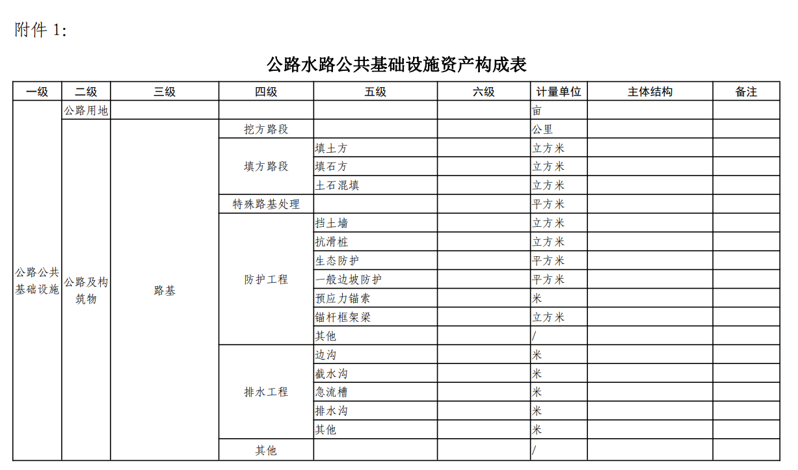

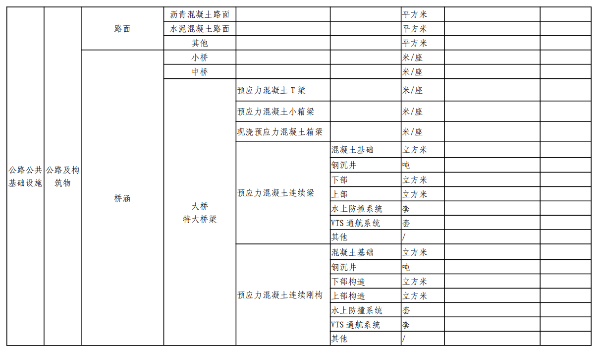

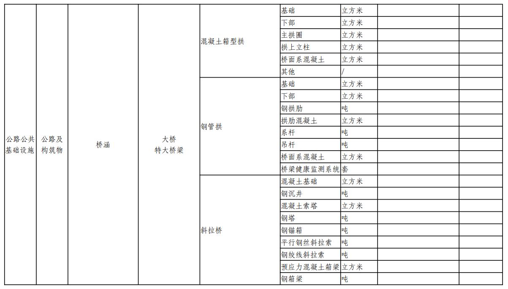

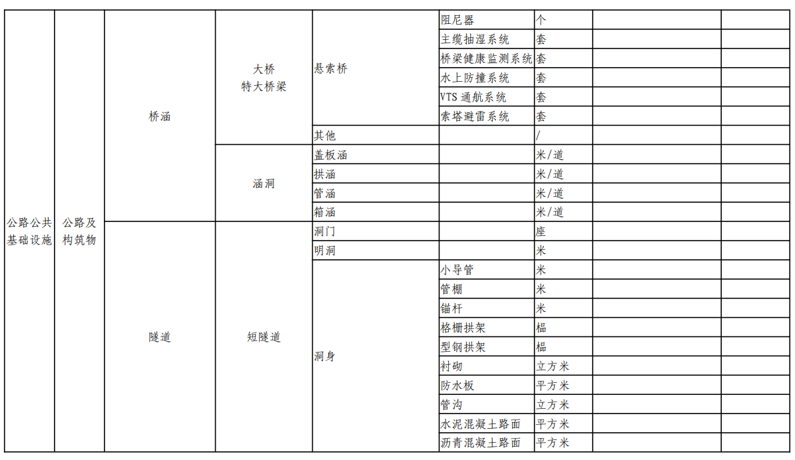

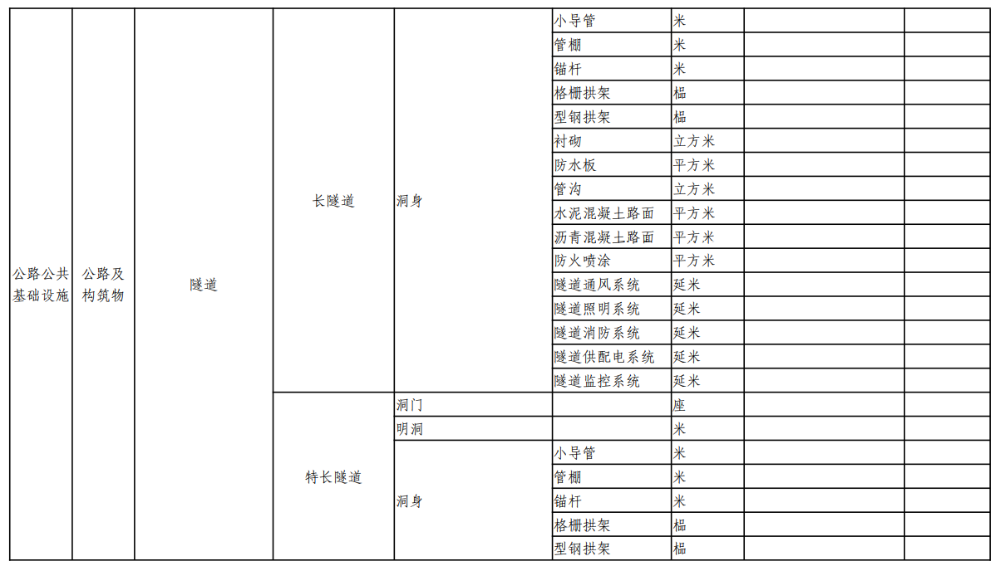

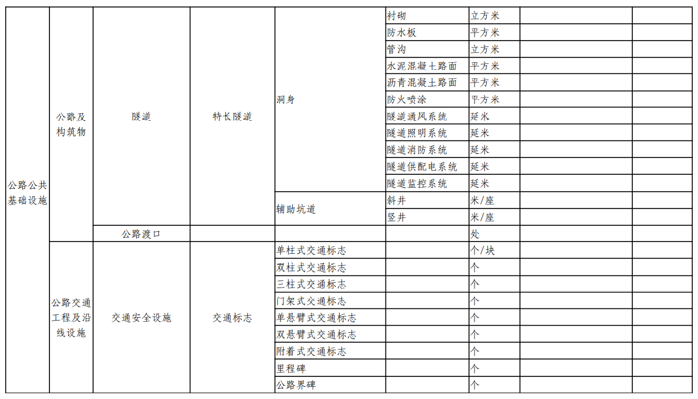

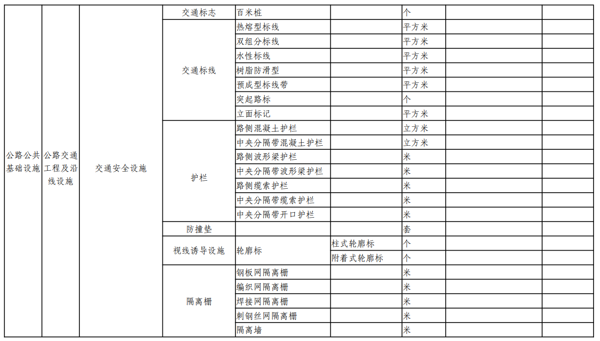

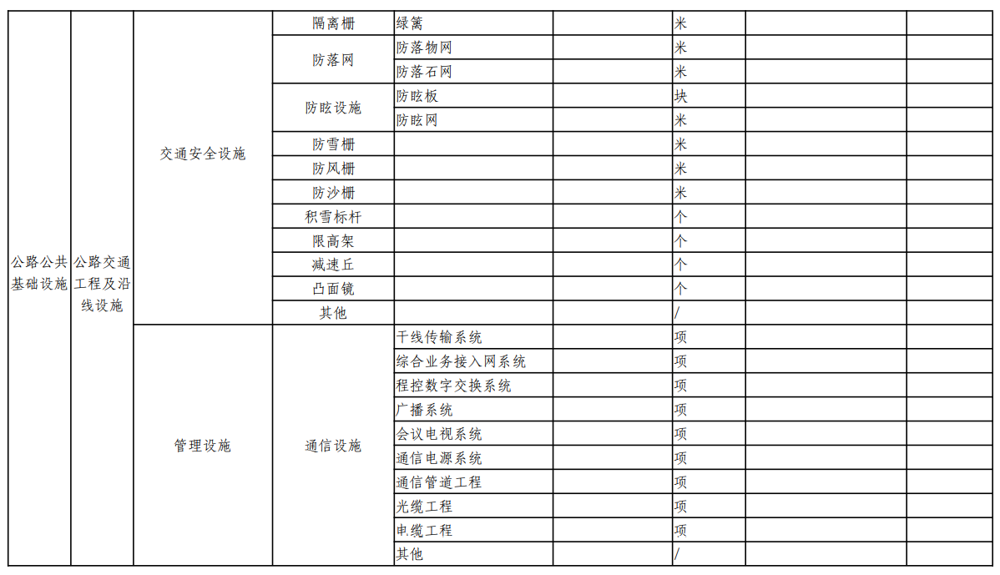

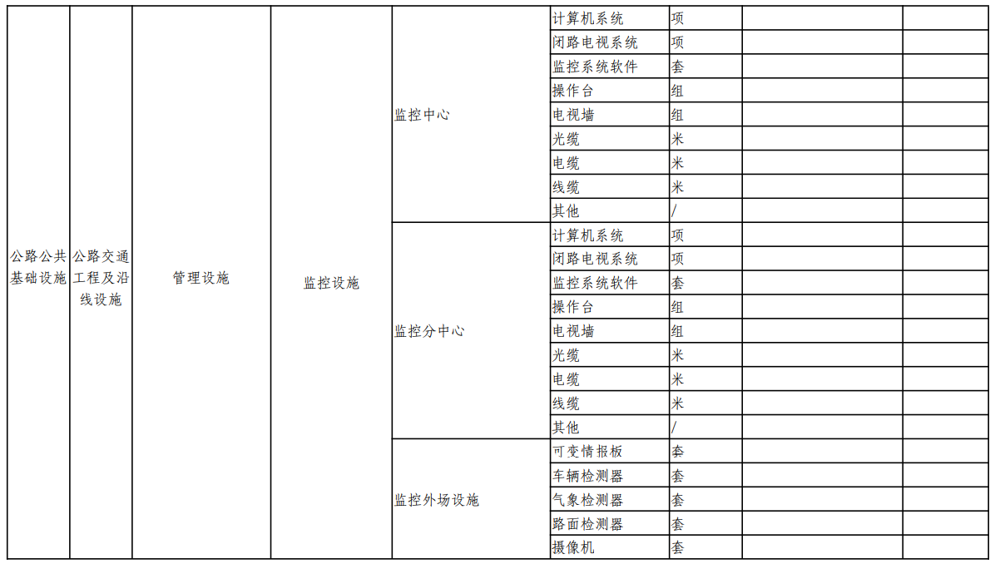

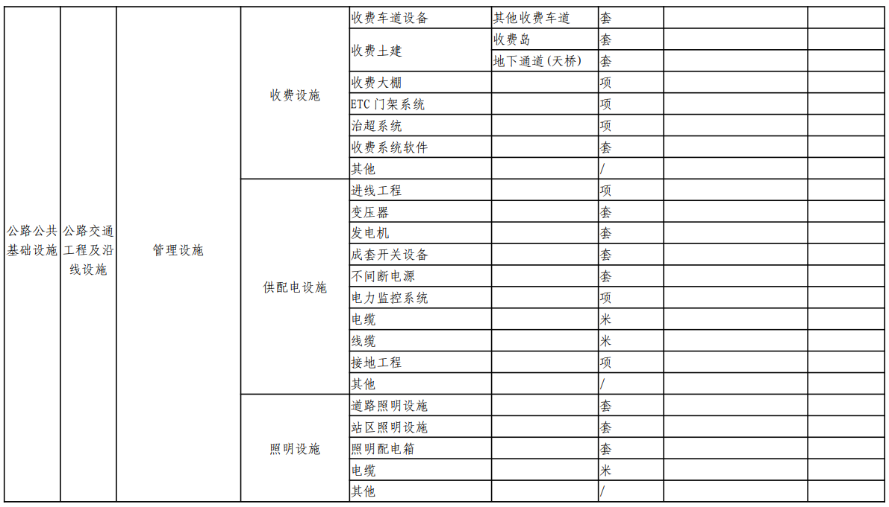

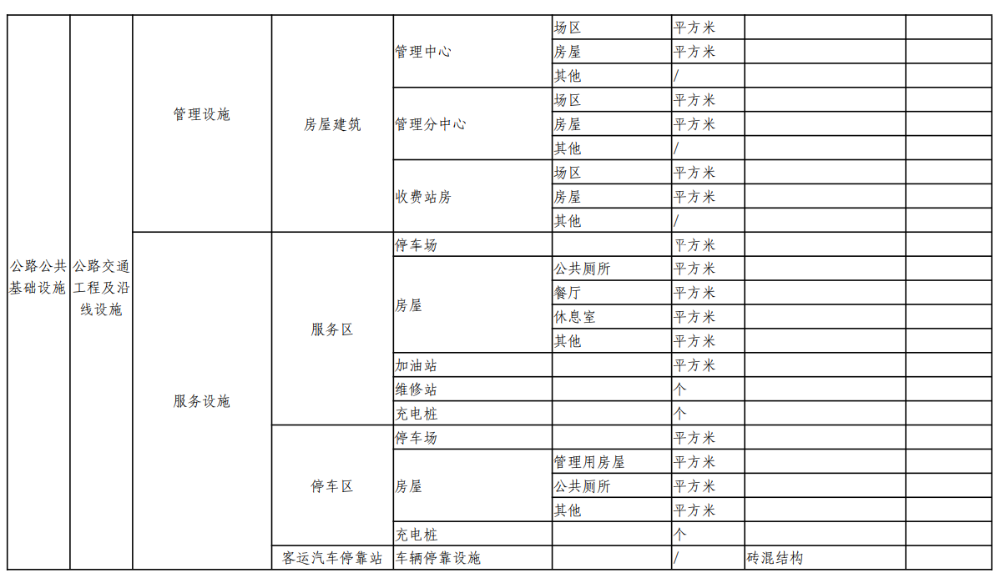

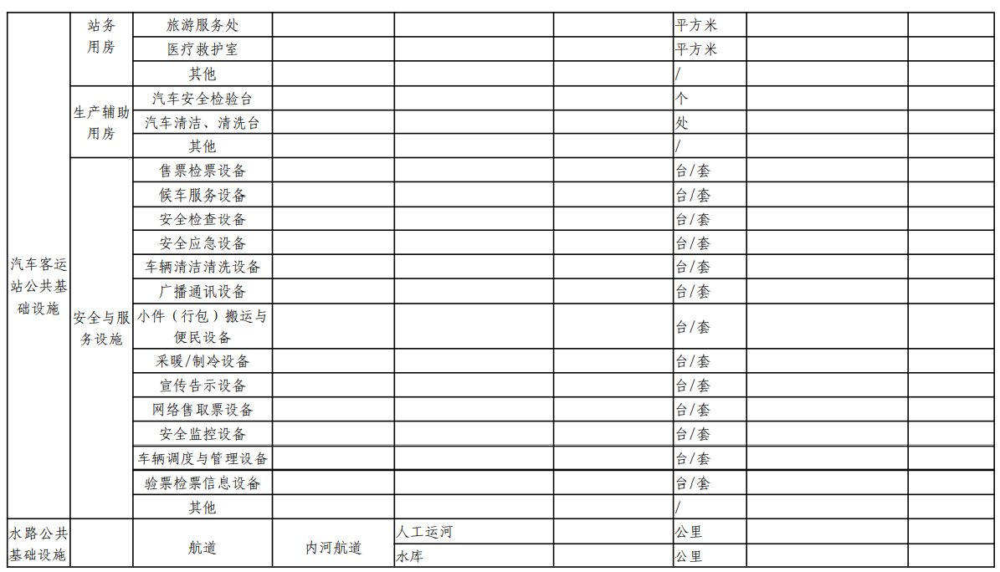

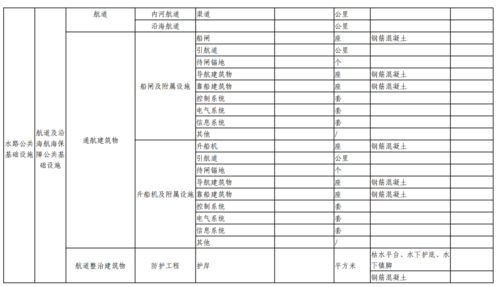

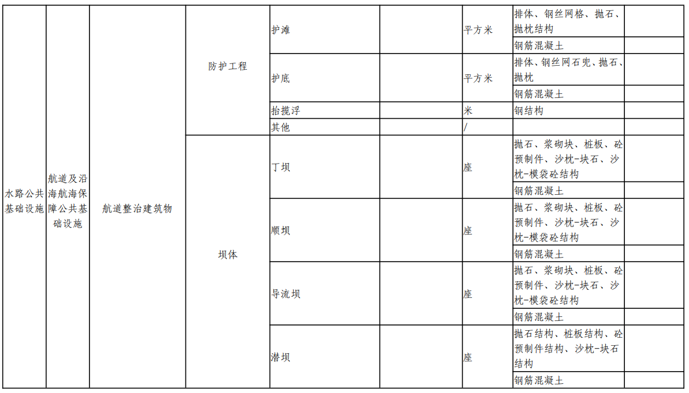

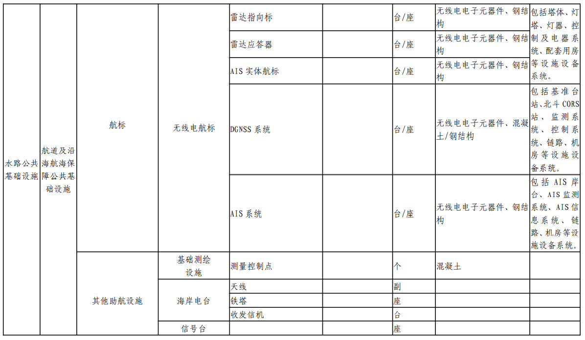

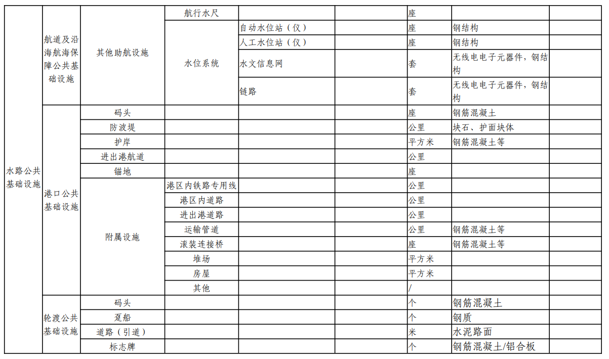

## 附件： 2.水利基础设施会计明细科目及编号表